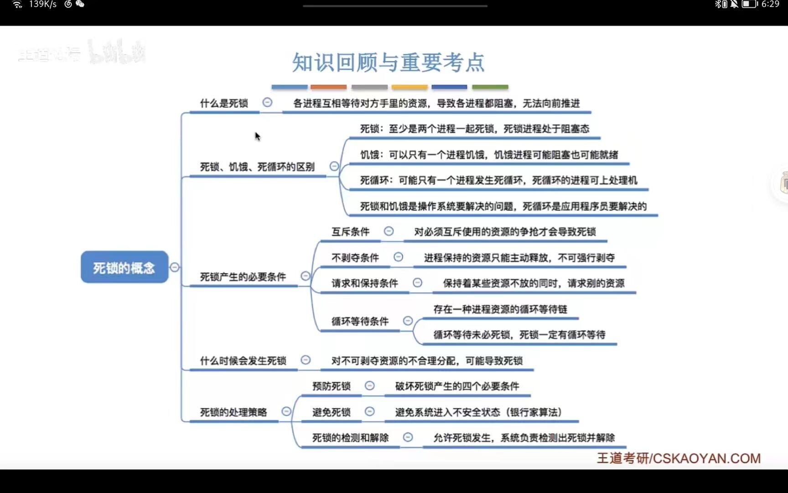
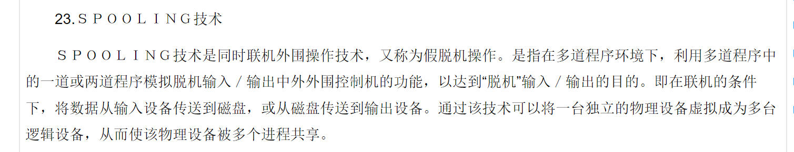

通用操作系统特点

+ 操作系统是程序的集合
+ 操作系统管理和控制系统资源
+ 操作系统提供了方便用户使用的用户界面
+ 操作系统优化了系统功能
+ 操作系统协调计算机的各种动作

分时操作系统

定义：分时系统是指多个用户同时分享一个计算机

特征：多路性、交互性、独立性、及时性

多道批处理系统的定义以及特征

+ 提高系统的运行性能和效率
+ 运行时间长

**操作系统定义：是控制和管理计算机系统内各种软硬件资源、有效组织多道程序运行的系统软件，是用户和计算机之间的接口**

**API定义：**

应用程序接口（英語：application programming interface），缩写为API，是一种计算接口，它定义多个软件中介之间的交互，以及可以进行的调用（call）或请求（request）的种类，如何进行调用或发出请求，应使用的数据格式，应遵循的惯例等。

**程序定义：适用于计算机处理的一系列指令，按照一定的逻辑被要求划分为多个相关模块，这些模块必须顺序的执行。**

**并发程序的定义：多用户存在的是宏观上的并行程序，以及并发程序**

并发程序特征：动态性、制约性、并发性

进程定义：进程是并发程序的一次执行过程，进程是一个具有一定独立功能的程序关于某个数据集合的一次运动活动

进程的基本状态：运行态、就绪态、等待态

信号量基本流程：信号量是一个数据结构，有两个变量构成

+ 整数变量：V
+ 指针变量：S

临界段定义及设计原则，进程互斥控制的一般方法，

典型算法：临界段是使用临界资源的程序段。

设计原则： 

​	（1）每次至多允许一个进程处于临界段中； 

​    （2）对于请求进入临界 段的多个进程，在有限时间内只让一个进入；

​	（ 3）进程只应在临界段中停留有限时间；

进程同步控制的一般方法，典型算法（生产者 - 消费者模型，读者 - 写者问题） 

进程通信概念及基本方法： 进程之间的消息交换称为进程通信（IPC）， 通信方法有消息通信和管道

线程定义：表示进程中可以并发执行的程序段，它是可执行代码的不可拆散的单位。进程和线程的主要区别：调度方面，拥有资源，并发性，系统开销。

地址重定位：根据装入的起始位置来修改程序中指令要访问的地址，将相对地址改为绝 对地址，绝对地址 =（BR） +相对地址

静态重定位： 是指在装入过程完成后在程序运行前， 一次将所有的指令要访问的地址全部改 为绝对地址， 在程序运行过程中不再修改。 静态地址重定位的优点是不需要硬件支持， 但是缺点是必须占有连续的内存空间，这就难以做到数据和程序的共享。

**动态重定位：是在程序运行过程中，当指令需要执行时对将将要访问的地址进行修改 动态重定位的优点有：内存可以不连续分配、提供实现虚存的基础、有利于程序共享。**

静态分页管理的地址转换过程： 

原理： 作业地址空间划分成连续的大小相同的页面， 内存划分成连续大小相等的块， 页面的 大小与内存块的大小完全相同。 

逻辑地址：逻辑地址被分成两部分： 页面号和页内唯一， 页内位移范围与内存块的大小有关， 页号的范围还取决于逻辑地址的位数。

页表： 页表用来说明作业号与内存块号的对应关系， 内容包括页面号，内存块 号；

页表寄存器： 页表寄存器用来存放作业所对应的页表的起始地址； 

内存分块表和作业表：内存分块表内容为块号、块使用状态（已使用或未使用），作业表内容为作业号、页 表起始地址。 

地址映射： 地址转换是通过页表寄存器所指定的页表来实现的。 

假定逻辑地址为页号 P 和页内位移地址 d，转换方法如下：页表起始地址 =（页表寄存器）页表中页号 为 P 的表目地址 =（页表寄存器） +表目长度 *P, 由此获得对应的内存块号 P’。绝对地址 =p'* 页框长度 +d 

静态分页管理优缺点：管理简单；每访问一次内存数据需要经过二次寻址，即对页表地 址的访问和对内存块内地址的访问； 解决了碎片问题； 无法实现共享； 作业大小受内存可用 页面数的限制

平均带权周转时间越小， 系统中作业的等待时间越短， 同时系统的吞吐量越大， 系统的资源 利用率越高。

文件系统的定义 : 对用户提供友好的接口让用户实现按名存取；能提供对文件的各种操 作；可以实现文件共享与保护；对外存存储空间的管理；文件系统应提供各种安全措施。 

用户可见的文件结构称为文件的逻辑结构： 

a. 流式无结构文件是由相关联的字符流组成 的文件，文件的长度为所含字符数， 字符为基本管理单位，空间利用节省。 

b. 记录式结构文 件是有结构的文件，由相关联的若干记录构成的， 方便用户对文件中的记录进行修改、 追加、查找等操作。

文件的物理结构代表了数据的存储方式： 

a. 连续文件，是指把逻辑上连续的文件信息依 次存放到连续的物理块中，连续文件结构简单，实现容易。 

b. 串联文件，又称为链接文件， 把逻辑上连续的文件信息分散存放到不连续的块中， 串联文件提高了存储空间利用率， 消除 了外部碎片。 

c. 文件映照， 在系统中建立一张文件映照表， 把所有盘块的指针都存放到该表 中，每个指针占一个表项，文件映照表增加了存储开销， 提高了访问速度。 

d. 索引文件系统 为每个文件建立一张索引表，给出逻辑块号和分配给它的物理块号的对应信息。

缓冲概念及基本缓冲技术：缓冲，主要是用来传输效率不同步或优先级不同设备之间传 输数据， 一般是先将一方数据临时存放， 然后待时机合适再将数据统一发送到另一方， 从而 降低了系统的等待时间。基本缓冲技术：单缓冲，双缓冲，环形缓冲，缓冲池

 Spooling 技术概念： Spooling 又称假脱机技术，现代操作系统都支持该技术，它主要 实现将独享设备虚拟为共享设备。 Spooling 技术在大容量外存的支持下，由预输入程序和预输出程序来进行数据传输。

操作系统分类：分布式操作系统，网络操作系统， Windows 的网络操作系统， Linux 操作系统

分布式操作系统定义及特点：分布式操作系统是建立于分布式系统基础之上的，对所有 分布式资源进行管理和控制的操作系统。特点：资源共享，开放性，并发性，可靠性，数据 一致性，透明性。

进程是一个动态的概念，程序是一个静态的概念

进程的并发执行是指进程一组进程的执行在时间上是重叠的

逻辑地址：是程序编译后，生成的目标模块进行编址时都是从0号单元开始编址，称之为**目标模块的相对地址**，即为逻辑地址。

物理地址对应的是内存的基址

