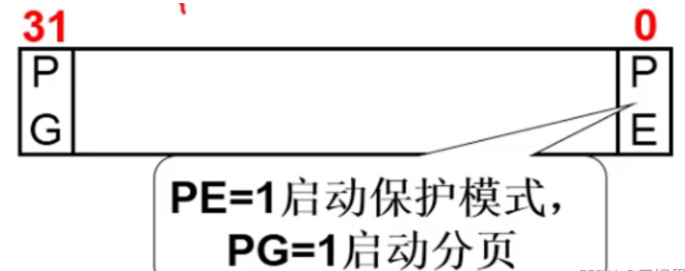

+ [author](https://github.com/3293172751)
# 第25节 操作系统的启动
+ [回到目录](../README.md)
+ [回到项目首页](../../README.md)
+ [上一节](24.md)
> ❤️💕💕真正动手时间操作系统,从应用软件出发"进入操作系统",成为掌握计算机关键技术的工程师。Myblog:[http://nsddd.top](http://nsddd.top/)
---
[TOC]

+ [x] 详细参考《Linux0.11》这本书

## setup模块

**setup：将完成os启动前的设置**

```assembly
;内存地址	长度		名称
;0x90000	2		光标位置
;0x90002	2		物理内存大小
;0x9000c	2		显卡参数
;0x901FC	2		根设备号

start:
	mov ax,#INITSEG
	mov ds,ax
	mov ah,#0x03
	xor bh,bh		;异或
	int 0x10		;取光标位置dx
	mov [0],dx		;
	mov ah,#0x88	
	int 0x15		;重点
	mov [2],ax		;获取物理内存大小
	cli				;不允许中断 clear interupt
	mov ax,#0x0000	;clear director
	cld				;字行块传送时使用的，它们决定了块传送的方向
do_move:
	mov es,ax		;es目标段地址，置为0x0000
	add ax,#0x1000
	cmp ax,#0x9000
	jz end_move
	mov ds,ax		;ds源段地址,置为0x9000
	sub di,di 		;源偏移地址设为0
	sub si,si		;目标偏移地址设为0
	mov cx,#0x8000	;重复次数0x8000字 32768word 65525bytes
	rep	movsw		;将system模块的代码移到0地址
	jmp	do_move 

```

这段代码的主要作用是在做操作系统建立之前的准备工作，获取必须的信息。如获取机器的物理内存大小。最后将system模块移到0地址，这也是为什么第一节要移动bootsect代码腾出空间，就是为此处system模块预留空间。

----

setup即将退出舞台，但是操作系统运行不能断，还得跳到另外一个地方去执行，所以setup最后做了一件非常重要的事：进入保护模式。

```assembly
mov ax,#0x0001 
mov cr0,ax 			;cr0是个很猛的寄存器
jmpi 0,8			;非常重要的一条指令
```

`jmpi 0, 8`：把`0`赋给IP，把`8`赋给CS

如果按实模式`cs=0x0008`，`ip=0x0000`的寻址结果为`0x0080`。此处为`system模块`代码，真的跳到此处就会死机。**应该是跳到0地址处执行，因为寻址方式发生了改变。**

### 进入保护模式
按照实模式的寻址方式，**16位寻址模式左移4位+4位，可以形成20位地址（x86 20根地址线），最大可以寻到1MB处，离1G，4G，8G还远得很。所以要更换寻址方式。切换到保护模式，启用32位寻址模式。**

> 16位和32位的区别在哪儿呢？
>
> 就是程序的解释方式变了，以前是CS左移4位+IP，现在的寻址模式就变了。


### cr0寄存器

**cr0来决定是保护模式还是实模式**




PE置为1后：`mov cr0,ax ;cr0`是个很猛的寄存器

CPU要走另外一条解释执行的电路了。具体如何解释执行呢？


## 保护模式下的地址翻译和中断处理

+ [x] [第二十六节 : 实模式到保护模式](26.md)

硬件GDT，为了快。寻址模式变更，**CS变为选择子**（select），**现在CS变为查表的索引**，**真正的基址写在表中**。现在寻址是先通过CS选择子从表中找到基址再+IP进行才获取到真正的地址。所以Setup还要初始化表：

```assembly
end_move:
	mov ax,#SETUPSEG
	mov ds,ax
	lidt idt_48
	lgdt gdt_48	;设置保护模式下的中断和寻址

idt_48:.word 0 .word 0,0 ;保护模式中断函数表
gdt_48:.word 0x800 .word 512+gdt,0x9 
gdt:.word 0,0,0,0						;第0个表项
	.word 0x07FF,0x0000,0x9A00,0x00C0 	   ;第1个表项
	.word 0x07FF,0x0000,0x9200,0x00C0      ;第2个表象 每一个表项有四个word 一个word16位 
										;故每个表项 64bit 
										;寻址的时候以字节位单位，所以第二行开头是64bit，8字节即CS=8
```


## aoEND 链接

+ [回到目录](../README.md)
+ [上一节](24.md)
+ [下一节](26.md)
---
+ [参与贡献❤️💕💕](https://github.com/3293172751/Block_Chain/blob/master/Git/git-contributor.md)