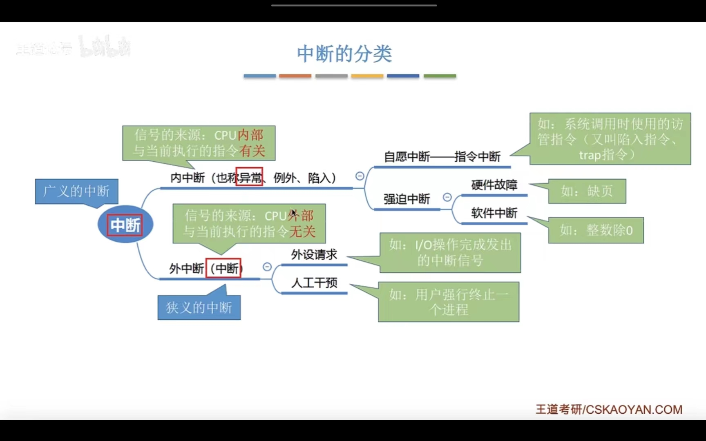
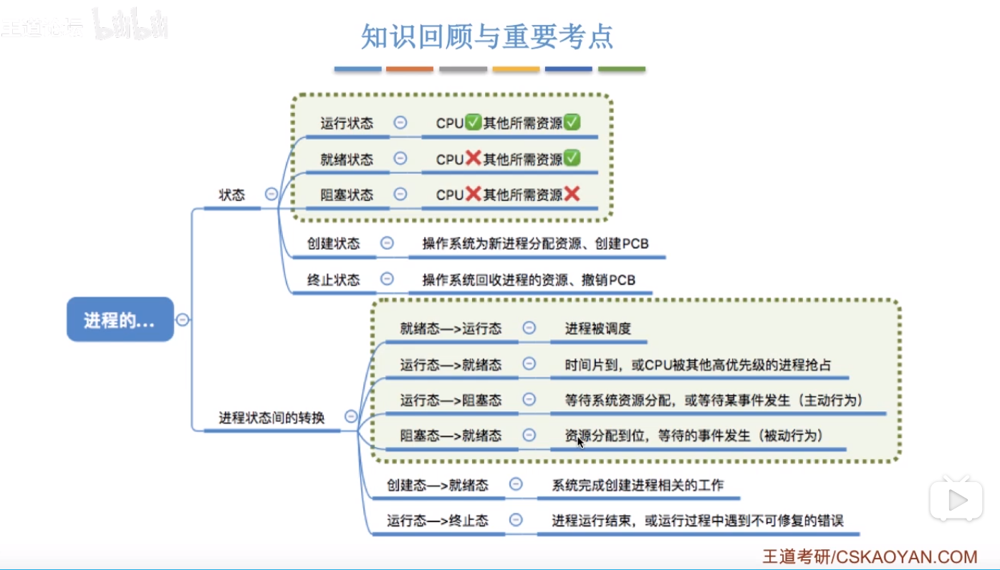
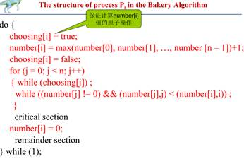
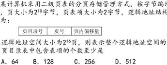
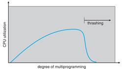
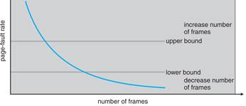
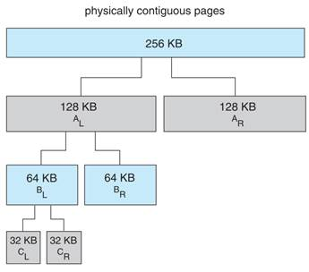
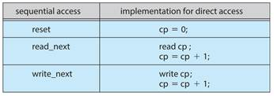
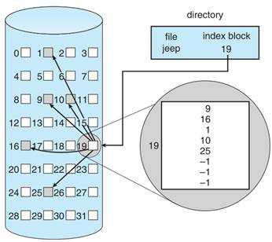

# 操作系统期末复习

[toc]

##  **第一章概述**

操作系统作为用户和硬件之间的中间人。

操作系统的目标：用户需求：操作系统需要容易学容易用，可靠性高，速度快。系统需求：OS必须易于设计实现维护，灵活可靠错误少高效。

计算机系统分为四大部分：**硬件、OS、应用程序和用户。**

操作系统时用户与计算机硬件之间的接口。操作系统提供的接口有两类：命令级接口，提供键盘或鼠标命令。程序级接口：提供系统调用。

操作系统是计算机系统资源的管理者。OS是资源分配者是一个控制程序。

OS是扩充裸机的第一层系统软件。

### **几个重要的概念–操作系统特征：**

+ 并发（是以下特征的基础基基础）
+ 共享：资源同时被多个并发程序使用—没有共享就没有并发（不需要并发）
+ 虚拟：物理实体变为若干个逻辑对应物
  + 空分复用技术
  + 时分复用技术
+ 异步：多道程序下，并发进行，但是资源有限，执行是走走停停的，**以不可预料的速度向前推进，这就是异步**

> 最基本：并发和共享（互为存在条件）

**大型机系统 Mainframe System**

+ OS有：批处理系统、分时系统。批处理可以分为多道和单道两种。

+ 多道程序：多个作业保存在内存中，CPU在它们之间进行切换。

+ 发展：no software->resident moniters->muli-programming->multi-tasking。

### **Time Sharing system 分时系统**：分时系统是多个用户分时共享，把系统资源分割，每个用户轮流使用一个时间片。

+ CPU - 队列 ： 交替式轮流分配到各个联机作业
+ 并行性：多个程序相互向前推进,宏观上同时运行
+ 独占性：各个程序独占cup。彼此感觉不到别人的存在
+ 交互性：用户和计算机之间的交互（bin/bash)
+ 缺点：不能优先处理紧急任务

### **实时操作系统：对于输入信息，在规定的时间内处理完毕并且作出反应**

+ 硬实时系统：必须在规定时间内完成处理
+ 软实时系统：可以接受偶尔违规
+ 不能人机交互，但可以优先处理紧急任务

**多道程序运行的特征**：

1. 多道，计算机主存中存放几道相互独立的程序
2. 宏观上并行，同时进入系统的程序都处于运行中，即他们先后开始各自的运行，但都未运行完毕
3. 微观上串行，多道程序轮流或者分时占用处理机，交替进行

**桌面系统 Desktop：**PC

**集群系统 Clustered：**一组互联主机构成的统一的计算机资源。有对称集群，多个节点跑程序，互相监视。非对称：一台机器处于热备用模式。集群用于高性能计算。

**实时系统 Real Time**：有软实时 硬实时。用于工业控制、显示设备、医学影像、科学实验

手持Handheld：PDA cellular telephone

嵌入式.

**操作系统市场格局**，三大体系：Unix服务器 Win桌面 Android 手机

# 第二章

### **中断**

+ 中断一个程序的执行只能发生在某条指令周期末尾。

+ 当中断发生时，CPU会立即进入内核态。实际上，用户态和内核态之间的切换也是依靠中断完成的
+ 当中断发生，当前运行的进程会暂停运作，并且交由操作系统内核对中断进行处理
+ 对于不同的中断，会进行不同的处理

**中断需要保存的现场信息：**

1. 执行每一个指令后，CPU检查当前是否有外部中断信号（如用户输入一个字符）

2. 有信号的话，就保护（保护现场：硬件软件共同完成）被中断的进程CPU环境（程序状态字PSW、程序计数器PC、各种通用寄存器）

3. 根据中断信号的类型转入相应的中断处理程序

4. 恢复（恢复现场）原进程CPU环境并推出中断，返回原进程继续执行

   

**任何程序运行时都有反映其运行状态的一组信息，有的机器将这一组信息集中在一起成为程序状态字，存放这些信息的寄存器称之为程序状态器。**

**有的机器（PDP11）把这些信息放在两个寄存器中**

1. 程序计数器PC
2. 处理器寄存器PS

发生了中断，就说明需要操作系统介入，开展管理工作。而操作系统的管理工作（比如进程切换，分配I/O设备等）需要特权指令，因此使用CPU要从内核态转入内核态。故而，**中断可以使得用户态转为内核态，使得操作系统获得计算机的控制权**。中断处理在操作系统的微内核中。有了中断才可以实现多道程序并发执行。

用户态与内核态是通过寄存器`psw`来标志的：

+ 用户态--> 内核态：是通过而且只能通过中断的方式
+ 内核态--> 用户态：只是需要将`psw`设置为用户态

### **中断分类**

1. 外中断

由 CPU 执行指令以外的事件引起，如 I/O 完成中断，表示设备输入/输出处理已经完成，处理器能够发送下一个输入/输出请求。此外还有时钟中断、控制台中断等。

2. 异常

由 CPU 执行指令的内部事件引起，如非法操作码、地址越界、算术溢出等。

3. 陷入

+ 在用户程序中使用系统调用。

+ **陷入指令：在用户态执行的，执行陷入指令后立即引发一个内中断，从而CPU进入核心态**

+ **发出系统调用请求是在用户带，而对系统调用的相应处理在核心态下进行的**

+ **陷入指令是唯一一个只能在用户态执行的指令，而不能在核心态执行的指令**

**特权指令：**用户程序不能直接使用，如IO 时钟设置 寄存器设置，系统调用不是特权指令

+ 双模：用户态：执行应用程序时。内核态：执行操作系统程序时。用**程序状态寄存器（PSW）标记**

+ 内核态：能够访问所有系统资源，可以执行特权指令，可以直接操作和管理硬件设备。操作系统内核程序运行在内核态下。使用内核栈

+ 用户态：只能访问属于它的存储空间和普通寄存器，只能执行普通指令。用户程序以及操作系统核外服务程序运行在用户态下。使用用户栈

**操作系统结构**

用户界面：CLI GUI

程序执行 IO操作 文件系统操作 通信 错误检测 资源分配 统计 保护和安全

操作系统接口：命令接口和程序接口(系统调用)

命令接口：CLI GUI

程序接口：系统调用指OS提供的服务。

**系统调用是进程和OS内核间的程序接口。**

> 一般用C/C++写，大多数由程序提供的叫做API应用程序接口，而不是直接的系统调用。三个常见的API是win32 API，POSIX API 和JAVA API。

OS被划分为很多层，最底层0层是硬件，最高层是用户接口。通过模块化，选择层，使得每个层使用较低层的功能和服务。

### 微内核结构microkernel system

只有最基本的功能直接由微内核实现，其他功能都委托给独立进程。也就是由两大部分组成：微内核和若干服务。好处：利于拓展、容易移植到另一种硬件平台设计。更加可靠（内核态运行的代码更少了），更安全。缺点：用户空间和内核空间的通信开销很大。Windows NT windows 8 10 mac OS L4

### 单/宏内核monolithic kernel

与微内核相反，内核的全部代码，包括子系统都打包到一个文件中。更加简单更加普遍的OS体系。优点：组件之间直接通讯，开销小；缺点：很难避免源代码错误 很难修改和维持；内核越来越大。如OS/360，VMS Linux

### 模块modules

大多数现代操作系统都实现了内核模块。面向对象，内核部件分离，通过已知接口进行沟通，都是可以载入到内核中的。总而言之很像层次结构但是更加灵活。Linux solaris。

# 第四章

进程有以下定义：

-   一个正在执行中的程序
-   一个正在计算机上执行的程序实例
-   能分配给处理器并由处理器执行的实体
-   一个具有以下特征的活动单元：一组指令序列的执行、一个当前状态和相关的系统资源集

也可以把进程视为由**程序代码、和代码相关联的数据集、进程控制块**组成的实体

**进程控制块**：由操作系统创建和管理。进程控制块包含了充分的信息，这样就可以中断一个进程的执行，并且在后来恢复执行进程时就好像进程未被中断过一样。进程控制块是操作系统能够支持多进程和提供多重处理技术的关键，**进程控制块是操作系统中最重要的数据结构，每个进程控制块包含操作系统所需要的关于进程的所有信息**

-   内存指针：包括程序代码和进程相关数据的指针，还有和其他进程共享内存块的指针
-   上下文数据：进程执行时处理器寄存器中的数据

进程被中断时，操作系统会把程序计数器和上下文数据保存到进程控制块中的相应位置

**程序状态字(PSW)**：所有处理器设计都包括一个或一组通常称为程序状态字的寄存器，包含有进程的状态信息

### **Process进程**

进程也是系统进行资源分配和调度的基本单位

进程是一个正在执行的程序。**进程包括**：PC,寄存器,数据段(全局data),栈(临时data),堆(alloc)。

### **进程状态**

总体：new,running,ready,waiting,terminated.

PCB：进程控制块，**描述一个进程和其他进程以及系统资源的关系，保存程序运行期间的相关数据。**

**基本状态：**

- **运行：占用CPU和其他资源**
- **就绪：占用所需资源但是没有CPU**
- **阻塞：没有资源没有CPU**
- 创建：创建PCB，分配资源
- 终止：回收资源和撤销PCB

进程状态会因为程序(系统调用),OS(调度),外部(中断)动作而改变状态。Wait->run和ready->wait一般不可能发生。单处理器下，最多一个run，ready进程构成就绪队列，wait进程构成多种等待队列。运行最多1最少0，等待最多n最少0，就绪最多n-1最少0。

### 进程控制

进程控制：就是实现进程之间的状态转换，是通过 **`原语`** 实现。

### 原语控制

原语控制，即某个任务要么不做，要么就就做完，执行期间**不允许中断，只能一气呵成**。原子操作即是如此。而原语操作是通过 **关中断和开中断** 指令实现。由于开关中断的指令权限很大，因此只能在内核态下执行的特权指令。

 

如图，在处理进程转换时，如果有外部信号到来，这个信号会被阻塞到开中断指令，然后操作系统才会响应中断信号。 如此才能保证进行转换的顺利进行。

#### 为什么采用原语控制

为了防止进程队列中与其进程状态标志不一致。通过原语控制，实现将进程放进某个运行状态的队列时，其对应的PCB数据也会被修改与所在队列保持一致。否则如果被中断，很可能会发生不一致，导致系统崩溃。

#### 进程控制相关原语

进程控制的相关原语，主要就是完成三个任务：

+ 更新PCB中的信息，如修改进程状态标志、将运行环境保存到PCB、从PCB恢复环境
  + 所有的进程控制原语一定都会修改进程状态标志
  + 剥夺当前运行态进行的CPU资源，肯定要去保存其运行环境
  + 某个进程开始运行前，也必然要恢复其上一次运行环境，如果是第一次，那么就是初始化设置。
+ 将PCB插入合适的队列
+ 分配/回收资源

**创建进程**：

+  创建原语：申请PCB，申请资源，初始化PCB，插入就绪队列

 

阻塞态：等待队列

就绪态：就绪队列

**阻塞和唤醒，是成对使用，因为什么原因阻塞，就相对应的因为其被唤醒。**

这个进程的切换原语，是一个动态的过程，上面的三个是静态的，对应于进程的某个状态。这个过程类似于函数调用。

### 进程通信

这部分详细参考`APUE`。

进程之间的信息交换。由于进程之间的内存地址空间是相互独立的，不允许进程之间直接访问。

#### 共享存储 `mmap`

这是由于进程中的共享区实现的，外部函数调用`mmap`。

#### `pipe`

 

#### 进程通信总结

### 线程

**为了增加并发度，引入了线程，此时程序的最小执行单元是线程，传统的是进程。**

**用户级线程**：不依赖于OS核心(内核不了解用户线程的存在), 应用进程利用线程库提供创建 同步 调度和管理线程的函数来控制用户线程。一个线程发起系统调用而阻塞，则整个进程在等待。

**内核级线程**：依赖于OS核心，由内核的内部需求进行创建和撤销 ，用来执行一个指定的函数。一个线程发起系统调用而阻塞，不会影响其他线程。时间片分配给线程，所以多线程的进程获得更 多CPU时间。

**多线程模型：**

多对一：将多个用户级线程映射到一个内核线程。由线程库在用户空间进行，如Solaris Green和GNU Portable。优点：无需OS支持，可以调整(tune)调度策略满足应用需求，无系统调用线程操作开销很低。缺点：无法利用多处理器 不是真并行，一个线程阻塞时整个进程也阻塞

一对一：一个用户到一个内核。每个内核线程独立调度，线程操作由OS完成，win NT/XP/2000 linux Solaris 9 later。优点：每个内核线程可以并行跑在多处理器上，一个线程阻塞，进程的其他线程可以被调度。缺点：线程操作开销大,OS对线程数的增多处理必须很好

多对多：多用户到多内核，允许OS创建足够多的内核线程，Solaris prior v9 win NT/2000 with ThreadFiber。两极模型：多对多的变种，一部分多对多，但是有一个线程是绑定到一个内核上。IRIX HP-UX Tru64 Solaris 8 earlier

fork：复制调用线程还是复制全部线程，UNIX两种都有；exec替换整个进程也就是所有线程。如果fork后跟exec那么fork就复制调用线程即可。两种线程取消：异步取消：立即终止目标线程，延迟(deferred)取消：目标线程不断检查自己是否该终止。信号处理：信号由特定事件产生，信号必须要发送给进程，信号被发送后需要被处理。选择：发送信号到信号所应用的线程；到进程内的每个线程；进程内的某些线程；规定特定线程接收信号。线程池：优点：用现有县城处理请求比等待创建新线程快；限制了可用线程的数量。线程特有数据：允许县城自己保存数据拷贝，在无法控制创建线程时很有用，比如用线程池的时候。

调度程序激活 Scheduler Activations

多对多和两级模型需要通信来维护分配给应用适当数量的线程；SA提供upcalls，一种从内核到线程库的通信机制；这种通信保证了应用可以维持正确数量的线程。Win xp linux

WIN XP实现一对一模型，但是通过fiber库也支持多对多。每个线程包括：ID 寄存器集 用户栈和内核栈 私有数据存储区。后面三个都是线程的上下文。主要数据结构ETHREAD执行线程块 KTHREAD内核线程块 TEB线程执行环境块 后者在用户空间 前两者内核空间。Linux把线程叫做tasks，除了fork，额外提供了线程创建通过clone系统调用完成，它允许子任务和父任务共享地址空间

**CPU Scheduling**

CPU调度时机：run->wait,run->ready,wait->ready以及终止时。调度只能发生在1和4时叫非抢占，否则叫做抢占。

分派程序(dispatcher)将CPU的控制交给由短程调度选择的进程。功能有：上下文切换 切换到用户模式 跳转到用户程序的合适位置来重启程序。分派程序停止一个进程而启动另一个所需要花费的时间叫分派延迟(dispatcher latency)。

**调度算法的选择准则和评价：**

面向用户：周转时间turnaround time(进程从提交到完成所用时间 包括就绪和阻塞中的等待时间 带权周转时间=周转时间/CPU执行时间) 响应时间 等待时间 截止时间 公平性 优先级。面向系统：吞吐量 throughput 处理机利用率CPU utilization 设备均衡利用。调度算法自身：易于实现 开销较小。最佳算法准则：CPU利用率 吞吐量 周转时间 等待时间 响应时间 公平

**调度算法**

First-Come, First-Served (FCFS) Scheduling：根据就绪状态的先后来分配CPU，非抢占，最简单，利于长进程，不利于断进程，利于CPU型不利于IO型。

Shortest-Job-First (SJF) Scheduling：对预计执行时间短的作业优先分派CPU，分为抢占式：如果新来的进程时间比当前的还短，抢占，这种SJF叫做Shortest-Remaining-Time-First (SRTF)。非抢占：允许当前进程运行完再运行最短的。SJF被证明是最佳算法，它能给出最小平均等待时间。

SJF是无法实现的，因为不知道下一个CPU脉冲burst时长。

最高响应比优先HRRN(Highest Response Ratio Next)：SJF的变种，响应比R = (等待时间 + 要求执行时间) / 要求执行时间，是FCFS和SJF的折中。满足短任务优先且不会发生饥饿现象

**优先级调度**

每个进程都有优先级数字相关联，总是把CPU分配给就绪中最高优先级的进程。确定进程优先级的两种方法：静态优先权：创建时就确定好 动态优先权：给予某种算法调整。一般数字越小优先级越高。SJF是以下一次CPU的脉冲长度作为优先数的优先级调度特例。优先级调度也可以是抢占/非抢占的。问题：无穷阻塞或借，低优先级的进程可能永远无法执行。解决方法：老化(aging)逐渐增加在系统中等待时间长的进程的优先级，也就是动态优先级。

**时间片轮转调度 Round Robin(RR)**

通过时间片轮转提高并发性和响应时间，提高资源利用率。算法：将就绪中的进程按照FCFS排队；每次调度时将CPU分给队首进程，让其执行一个时间片；时间片结束时发生时钟中断；调度程序暂停当前进程执行将其送至就绪的队尾，然后上下文切换至新的队首；对称没用完一个时间片的话就让出CPU(如阻塞)

如果就绪队列中有n个进程时间片为q，那么每个进程得到1/n的CPU时间，长度不超过q。每个进程必须等待的时间不超过(n-1)q，知道下一个时间片位置。例如5个进程，200ms时间片，那么每个进程每100ms不会得到超过20ms的时间。

RR算法性能依赖于时间片大小，如果q很大，就和FCFS一样了；如果q很小，那么q也要足够大来保证上下文切换，否则开销过大。时间片长度的影响因素：响应时间一定时，就绪进程越多，时间片越小；应当使用户输入通常能在一个时间片内完成，否则相应 平均周转和平均带权周转都会延长。一般来说RR比SJF有更高的平均周转，但是响应时间更好。时间片固定时，用户越多响应时间越长。

**多级队列调度**

将就绪队列根据性质或类型的不同分为多个独立队列区别对待，综合调度。每个作业固定归入一个队列。不同队列可能有不同的优先级 时间片 调度算法。例如系统进程、用户交互、批处理等这样的队列分法。

一般，分成前台foreground(交互式interactive)和后台(批处理)，后台一般RR，前台FCFS。多级队列在队列间的调度算法有：固定优先级，即先前台后后台，有饥饿；给定时间片，如80%执行前台的RR，20%执行后台的FCFS。

**Multilevel Feedback Queue Scheduling 多级反馈队列**

是RR和优先级算法的综合。与多级队列的区别，这个允许进程在不同的就绪队列切换，等待时间长的进程会进入到高优先级队列中。优点：提高吞吐量降低平均周转而照顾断进程；为IO设备利用率和降低响应时间而照顾IO进程型；不需要顾及进程执行时间，动态调节。

**Process synchronization**

**The Critical-Section Problem**

N个进程都计算同样的共享数据，每个进程都有一个临界区，其中共享数据被访问。问题：需要保证只有一个进程进入临界区。临界区问题的解决必须满足三个要求：互斥(mutual exclusion)；空闲让进(progress)；有限等待(bounded wait)。让权等待不是必须的。

**Peterson 算法**

只用于两个进程的情况，并且假设load和store是原子操作，是一种软件解决方法。

**Bakery Algorithm ( 面包房算法)**

**硬件同步**

单处理机很简单：临界区禁止中断，这样就OK了。

  

抽象出两个硬件实现的原子操作：赋值和交换，然后来解决临界区，testandset的共享变量是lock 初始false，swap也是一样，但是多了局部变量key不是共享的。

硬件方法优点：进程数随意，简单，支持多个临界区；缺点：无法让权等待，可能饥饿，可能死锁。会引起忙等

**信号量semaphores**

两个操作wait(P)和signal(V)。信号量分为计数信号量，值域不受限制，二值信号量，只能是01所以也叫互斥锁(mutex locks)。为了等待资源进行无限循环是忙等，通过对信号量的修改增加了block(run->wait)和wakeup(wait->ready)来避免了忙等。wait(semaphore *S) { S->value--; if (S->value < 0) { add this process to S->list; block();} } signal(semaphore *S) { S->value++; if (S->value <= 0) { remove a process P from S->list; wakeup(P);} }具有忙等的信号量值非负，但是这种实现可以为负，负数的绝对值代表等待该信号量的进程数，0代表无资源可用。Wait和signal成对出现，互斥操作就在同一进程出现，同步操作在不同进程。连续的wait顺序是需要注意的，但是连续的signal无所谓。同步wait和互斥wait相邻时，要先同步wait。优点：简单、表达能力强；缺点：不够安全，使用不当会死锁，实现复杂

优先级倒置(priority inversion) 当优先级较低的进程持有较高优先级进程所需的锁定时的调度问题

**Bounded-Buffer Problem有限缓冲区生产者 -消费者问题**

是很多相互合作进程的抽象。算法：设置N个缓冲项；信号量mutex初始化为1，用来保证对缓冲池访问的互斥要求；信号量full初始化为0，表示满缓冲项的个数；信号量empty初始化为N表示空缓冲项的个数。生产者：do {…produce an item in nextp …wait(empty); wait(mutex); …add nextp to buffer …signal(mutex); signal(full);} while (1);消费者：do {wait(full); wait(mutex); …remove an item from buffer to nextc …signal(mutex); signal(empty); …consume the item in nextc …} while (1);

**Readers-Writers Problem**

数据库读写的抽象。第一读写问题：允许多个读者同时读，但是只有一个写者，也就是没有读者会因为写者在等待而等待其他读者的完成，写者可能饿死。第二读写问题：写者就绪后，写者就立即开始写操作，也就是说写者等待时，不允许新读者进行操作，读者可能饿死。

共享数据有访问的数据、mutex初始1,保证更新readcount时互斥，wrt初始1,为读写公用，供写者作为互斥信号量，被第一个进入临界区和最后一个离开临界区的读者使用，其他读者不适用。Readcount初始0，用来跟踪多少进程正在读。写进程：do {wait (wrt) ; // writing is performed signal (wrt) ;} while (TRUE); 读进程：do {wait(mutex); readcount++; if (readcount == 1) wait(wrt);signal(mutex); …reading is performed …wait(mutex); readcount--; if (readcount == 0) signal(wrt);signal(mutex)； } while (TRUE);

**Dining-Philosophers Problem哲学家进餐**

典型的同步问题，问题描述：N个哲学家坐在圆桌，每个哲学家和邻居共享一根筷子；哲学家吃饭要用身边的两只筷子一起吃；邻居不允许同时吃饭；哲学家只会思考或者吃饭。

共享数据：数据集/一碗米饭；共享变量chopstick[5]初始为1；第i个哲学家进程：do {wait(chopstick[i]) wait(chopstick[(i+1) % 5]) … eat …signal(chopstick[i]); signal(chopstick[(i+1) % 5]); … think …} while (1);这个解决方案可以保证没有2个哲学家同时使用1个筷子，但是很显然会导致死锁，如果5个哲学家同时饥饿，同时拿起左手筷子，就死锁了。

一些其他的可能解决：最多只允许4个哲学家坐在桌上/临界区内必须拿起两根筷子/使用非对称的解决方法：奇数先拿左手，偶数先拿右手。这些额外限制都能防止死锁。

**Deadlock死锁**

死锁指多个进程因竞争共享资源而造成的一种僵局，若无外力作用，这些进程都将永远不能再向前推进。进程按以下顺序使用资源：申请 使用 释放。申请和释放为系统调用。

**四个必要条件：**

互斥：至少有一个资源处于共享模式，一次只能有一个进程使用该资源 占有并等待(hold and wait)：一个进程必须至少占有一个资源并且等待另一个资源，且该资源被其他进程占有 不可抢占：资源不能被抢占，只能在进程使用完成后释放 循环等待：进程间循环等待资源，A等B占的 B等C占的 C等A占的。

**资源分配图**，由点V和边E组成，V被分为两部分：系统活动进程的集合 系统所有资源类型的集合。进程Pi到资源Rj的有向边记为Pi->Rj，表示进程Pi已经申请了资源类型Rj的一个实例，叫请求边；资源Rj到进程Pi的有向边表示资源类型Rj的一个实例已经分配给了进程Pi，叫做分配边。进程用圆表示，资源类型用方表示，资源实体是方内部的点。

如果分配图无环->没有进程死锁，如果有环，那么可能死锁。如果每个资源恰好只有一个实例，有环则必死锁。如果环所在的资源类型是只有一个实例的，则必死锁。如果每个资源有多个实例，有环不一定死锁。

P4可能释放R2的实例，这个资源分配给P3，这样就打破了死锁。

**死锁处理**

保证系统不进入死锁：预防 避免prevention avoidence；允许进入死锁但是需要恢复：检测 接触detection recovery。U L W三个系统都忽略问题假装没有死锁，是鸵鸟方法。

**死锁预防**

通过限制请求的方式来预防死锁。

互斥：对于非共享资源必须互斥，例如一台打印机不能被多个进程共享，因此要互斥，而共享资源不需要互斥，也不睡导致死锁，类似只读文件。

占有并等待：必须保证：一个进程申请一个资源时不能占有其他资源。进程在执行前就要申请并分配资源，是资源静态预分配的方法；缺点：低资源利用率、可能饥饿。

非抢占：如果一个进程战友资源并且申请了另一个不能立即分配的资源，那么它现已分配的资源都可以被抢占，也就是被隐式释放了。抢占资源分配到进程所等待的资源的连表上。进程需要获取到原有的资源和申请的新资源后才能运行。

循环等待：按照资源请求递增的方式分配资源，通过资源的有序申请破坏了循环等待条件。

**死锁避免**

前面的方法虽然避免了死锁，但是降低了吞吐率，我们可以通过获取一些额外的事先信息从而避免死锁prior information。

最简单和最有效的模型要求每个进程声明它可能需要的每种类型的资源的最大数量。死锁避免算法动态检查资源分配状态，确保永远不会出现循环等待。资源分配状态由可用和已分配资源的数量以及进程的最大需求定义。

**安全状态：**对于所有进程，如果存在一个安全序列，那么系统就处于安全状态。对于进程序列P1,P2,…,Pn，如果对于每一个Pi,Pi仍然可以申请的资源数小于当前可用的资源加上所有进程Pj(i>j)所占有的资源，那么这一序列是安全序列。这种情况下，进程Pi的资源即使不能立即可用，那么Pi可等待知道所有Pj释放其资源，当它们完成时Pi就可以运行，Pi运行结束后，Pi+1就可以获得到所需的资源，如此进行。

安全状态->没有死锁；不安全状态->可能有死锁；避免->保证系统永远不进入非安全状态。

**资源分配图，单实体资源类型避免算法：**

引入一种新边cliam edge需求边，Pi->Rj表示进程Pi在未来可能请求资源Rj，用虚线表示。当进程真正请求资源时，用请求边覆盖掉需求边。当资源被分配给进程后，用assignment edge分配边来覆盖掉请求边，当资源被释放后，分配边恢复为需求边。系统必须事先说明需求边。

算法：假设进程Pi申请资源Rj。只有在需求边Pi –>Rj 变成 分配边Rj->Pi而不会导致资源分配图形成环时，才允许申请。

用该算法循环检测，如果没有环存在，那么资源分配会使系统继续安全状，否则就会不安全，Pi就要等待。

**银行家，多实体资源类型避免算法：**

每个进程实现说明最大需求；进程请求资源时可能会等待；进程拿到资源后必须在有限时间内释放它们。

数据结构：

N进程数，m资源类型的种类数；Available：长度为m的向量，表示每种资源的现有实例数量，available[j]=k表示j型资源还有k个；Max：n*m的矩阵，定义每个进程的最大需求，max[i][j]=k表示进程Pi最多可以申请k个Rj型资源；Allocation：n*m的矩阵，表示每个进程所分配的各种资源类型的实例数，allocation[i][j]=k表示已经为Pi分配了k个Rj型实例；Need：n*m矩阵，表示每个进程还需要的剩余的资源，need[i][j]=k表示进程Pi还可能继续申请k个Rj型的实例。Need=max-alloction。

**安全状态检测算法：**

\1. 设work和finish分别是长度为m和n的向量，初始化：work=available，finish[i]=false；

2.寻找i满足finish[i]=false且need[i]<=work，如果i不存在跳到第四步；

3.work=work+allocation[i],finish[i]=true，返回第二步；

4.如果所有的finish都是true，那么系统处于安全状态。

算法需要m*n*n的操作数量级确定系统状态

**资源请求算法：**

Request[i]为Pi的请求向量，如果request[i][j]=k那么进程Pi需要资源类型Rj的数量为k。当进程Pi请求资源时，动作如下：

1.如果request[i]<=need[i]跳到第二步，否则出错，因为进程Pi已经超过了其最大需求。

2.如果request[i]<=available跳到第三步，否则Pi必须等待，因为没有可用资源

3.假定系统可以分配给进程Pi请求的资源，进行下面的操作：Avaible=avaible-request[i];allocation[i]=allocation[i]+request[i];need[i]=need[i]-request[i]；如果产生的资源分配状态是安全的，那么交易完成且进程Pi可以分配到资源，如果新状态不安全，那么进程Pi必须等待Request[i]并且恢复到原有的资源分配状态。

**死锁检测**

允许系统进入死锁状态的话，那么系统就需要提供检测算法和恢复算法。

**等待图，单实体资源类型检测算法：**

等待图是资源分配图的变形，节点都是进程，Pi->Pj表示Pi在等待Pj释放Pi所需的资源。当且仅当等待图中有一个环，系统死锁，检测环的算法需要n*n，n为点数。

**多实体资源类型检测算法：**

数据结构：Available，alloction是一样的，request：n*m的矩阵，表示当前各进程的资源请求状况，request[i][j]=k表示Pi正在请求k个资源Rj。

算法：1.设work和finish分别是长度为m和n的向量，初始化：work=available，如果allocation[i]非0，finish[i]=false否则初始化为true；

2.寻找i满足finish[i]=false且request[i]<=work，如果i不存在跳到第四步；

3.work=work+allocation[i],finish[i]=true，返回第二步；

4.如果某个finish是false，那么系统处于死锁状态，且对应下标的进程Pi死锁。

算法需要m*n*n的操作数量级确定系统状态

**死锁检测算法的应用**

检测算法的调用时刻及频率取决于：死锁发生频率以及思索发生时受影响的进程数。如果经常发生死锁，那么就要经常调用检测。如果在不确定的时间调用检测算法，资源图可能有很多环，通常不能确定哪些造成了死锁

**死锁恢复**

检测到死锁后的措施：通知管理员 系统自己恢复。打破死锁的两种方法：抢占资源 进程终止。

**进程终止**

两种方法来恢复死锁：终止所有死锁进程 一次终止一个进程直到不死锁。许多因素都影响终止进程的选择：优先级 进程已经计算了多久，还要多久完成 进程使用了哪些类型的资源 进程还需要多少资源 多少进程需要被终止 进程是交互的还是批处理的

**抢占资源**

抢占资源需要处理三个问题：

选择一个牺牲品victim：要代价最小化

回滚：回退到安全状态，但是很难，一般需要完全终止进程重新执行

饥饿：保证资源不会总是从同一个进程中被抢占。常见方法是为代价因素加上回滚次数。

**Main Memory 主存**

层次存储中主存cache寄存器为volatie易失的。

逻辑地址/虚地址/相对地址：由CPU生成，首地址为0，逻辑地址无法在内存中读取信息。物理地址/实地址/绝对地址：内存中储存单元的地址，可以直接寻址。

物理地址中的逻辑地址空间是通过一对基址寄存器和界限地址寄存器控制的base and limit register。如果基址寄存器为300040，界限寄存器为120900，那么程序的合法访问从300040到420910(含)的所有地址。

**地址绑定的三种情况：**

编译时间：如果编译时就知道进程在内存中的地址，那么就可以生成绝对代码absolute code。

装载时间：编译时不知道在哪，那么编译器生成可重定位代码relocatable code。

执行时间：如果进程在执行时可以移动到另一个内存段，需要硬件支持也就是base and limit目前绝大多数都是采用这种。

**Memory-Management Unit (MMU)**

就是将虚拟地址映射到物理地址的硬件设备。在MMU中，base寄存器叫做重定位寄存器，用户进程送到内存前，都要加上重定位寄存器的值。PA=relocation reg+LA。用户程序只能处理LA，永远看不到真的PA。

**Dynamic Loading （动态加载）**

进程大小会收到物理内存大小的限制，为了有更好的空间使用率，采用动态加载。一个子程序只有在调用时才被加载，所有子程序都可以重定位的形式存在磁盘上，需要的时候装入内存中。OS不需要特别支持，是程序设计做的事。当需要大量的代码来处理一些不常发生的事时很有用，如错误处理。

**Dynamic Linking （动态链接）**

将链接延迟到运行时，DDL。动态链接需要一个存根stub，它是一小段代码，用来指出如何定位库程序。

**Swapping （交换技术）**

进程可以暂时从内存中交换到备份存储backing store上，当需要再次执行时再调回。需要动态重定位dynamic relocate

备份存储：是快速硬盘，而可以容纳所有用户的所有内存映像，并为这些内存映像提供直接访问，如Linux交换区 windows的交换文件pagefile.sys

Roll out roll in：如果有一个更高优先级的进程需要服务，内存交换出低优先级的进程以便装入和执行高优先级进程，高执行完后低再交换回内存继续执行。

交换时间的主要部分是转移时间transfer time。总转移时间与所交换的内存大小成正比。系统维护一个就绪的可立即运行的进程队列，并在磁盘上有内存映像。

**Contiguous Allocation （连续分配）**

内存通常分为两个区域：一个驻留resident操作系统，一个用于用户进程，由于中断向量一般位于第内存，所以OS也放在低内存。重定位寄存器用于保护各个用户进程以及OS的代码和数据不被修改。Base是PA的最小值；limit包含了LA的范围，每个LA不能超过Limit。MMU地址映射是动态的。

Multiple-partition allocation：分区式管理将内存划分为多个连续区域叫做分区，每个分区放一个进程。有固定分区和动态分区两种。

**动态分区：**

动态划分内存，在程序装入内存时切出一个连续的区域hole分配给进程，分区大小恰好符合需要。操作系统需要维护一个表，记录哪些内存可用哪些已用。从一组可用的hole选择一个空闲hole的常用算法first best worst-fit三种。分别是分配第一个足够大的/分配最小的足够大的/分配最大的。First和best在时间和空间利用率都比worst好。还有一个next-fit是每次都从上次查找结束的位置开始找，找到第一个足够大的。

**碎片 fragmentation**

first和best都存在外部碎片的问题。外碎片指所有的总可用内存可以满足请求，但是并不连续。外碎片可以通过紧凑compaction拼接defragmentation减少。重定向是动态并且在执行时间完成可以进行紧凑操作 重新排列内存来将碎片拼成一个大块，但是拼接的开销很大。

内碎片是进程内部无法使用的内存，这是由于零头和块大小造成的，比如块大小8B，进程有9B，那么不得不给他16B的内存，就出现了7B的内碎片。

**分页存储管理**

分页允许进程的PA空间非连续；将物理内存分为固定大小的块，叫做帧frame/物理块/页框，将逻辑内存也分为同样大小的块叫做页page，Linux Win(x86)是4KB。

OS需要跟踪所有空闲帧，叫帧表。

运行一个n页的程序就需要找到n个空帧然后装载进去。

OS需要维护一个页表来进行LA到PA的转换。分页技术避免了外碎片，只有内碎片存在。

物理地址 逻辑地址 页表项数计算：

页表项数和内存大小相关 2^m B的内存大小对应需要m项的页表，物理地址长度为m。

逻辑地址和页表大小及虚存空间有关：虚存大小2^m B那么逻辑地址长度为m，页表大小2^n B，则页偏移位数n，页号位数m-n。

地址映射过程：逻辑页号拼上offset经过页表查到物理页号，然后得到物理真号拼上offset，然后进入到内存中找frame。

**页表的实现**

页表放在内存中。PTBR page-table base reg指向页表，切换页表只需要改变这个寄存器就可以 PRLR page-table length register说明页表长度，这样的模式下每次数据/指令访问都需要两次内存访问，一次查页表一次查数据/指令。为了加速这个过程，引入了特殊的转换表缓冲区TLB，是一种硬件cache。部分TLB维护了ASID addressspace identifier，用来唯一地标识进程，为进程提供空间保护。

**Effective Access Time有效访问 时间EAT**

Associative lookup=t1查TLB表的时间

Memory access time=t2 内存访问时间

αTLB命中率

那么EAT=(t1+t2)* α+(t1+t2+t2)* α

也就是查TLBmiss后，需要进内存查一次页表，再去取一次数据，命中就直接取数据。

**保护 protection**

内存保护通过与每个帧关联的保护位实现。Valid bit存在页表中的每一个条目上。

Shared code共享代码：如果代码是可重入即只读代码reentrant code或者是纯代码pure code，可以共享，共享代码在各个进程中的逻辑地址空间相同。然后每个进程再花较小的空间保存私有代码和数据即可。

**分级页表 Hierarchical page table**

由于现代计算机逻辑地址空间很大，导致页表会很大，而且页表还要连续，所以不现实。因此要将页表划分变小。简单的实现方法：两页分页算法，就是将页表再分页。就是将页号部分再划分为页偏移和页码。下面是寻址模式：

P1是用来访问外页表的索引，p2是外页表的页偏移，然后d是内页表的偏移。对于一个32位的LA，一般10位外10位内12位偏移

页大小为210B，页表项大小为2B，采用二级页表，一页可存放29个页表项，逻辑地址空间大小为216页，要使表示整个逻辑地址空间的页目录表中包含的个数最少，则需要216/29=27=128个页面保存页表项，即页目录表中包含的个数最少为128。

**哈希页表**

超过32位LA地址空间时，一般采用哈希页表，将虚页号的哈希值存到哈希表里，哈希表的每一项都是链表，链着哈希值相同的页号。然后在查表时用虚页号与链表中的每个元素进行比较从而查物理表号

**反向页表**

对于每个真正的内存帧才会有一个条目。每个条目包含保存在真正内存未知的页的虚地址及拥有该页的进程信息。因此整个系统只有一个叶彪，对每个物理内存的帧也只有一条相应的条目。拿时间换空间，需要为页表条目中添加一个地址空间标识符ASID。

**分段Segmentation**

分页无法避免的是用户视角的内存和物理内存的分离。分段管理支持用户视角的内存管理方案，LA空间是由一组段组成的，每个段都有其名称和长度，地址指定了段名称和段内偏移。因此LA通过有序对<segment-number,offset>构成。

段表将用户定义的二维地址映射成一维，每一个条目包含base和limit。STBR segment table base reg 指向内存中段表的位置，STLR一个程序使用的段长度，用户使用的有序对中的segment-number必须小于STLR。同样有valid位，还有读写执行的权限设置，也可以进行code share。内存分配是动态存储分配问题。

**Virtual Memory 虚存**

虚存将用户的路基存储和物理存储分开；LA空间可以大于PA空间；允许PA空间被多个进程共享。

局部性原理：时间：指令的一次执行和下次执行 数据的一次访问和下次访问都集中在一个较短时期内；空间：当前指令和邻近的指令 当前数据和邻近的数据都集中在一个小区域内。

虚存是是具有请求调入功能和置换功能，能仅把进程的一部分装 入内存便可运行进程的存储管理系统，它能从逻辑上对内存容量进行 扩充的一种虚拟的存储器系统。

**按需调页Demand Paging**

指在需要时才调入相应的页的技术。采用lazy swapper的方式，除非需要页面，否则不进行任何页面置换。

**页错误Page fault**

非法地址访问和不在主存或无效的页都会page fault。Page fault rate等于1不代表every page is a page fault。

**更完整的页表项请求分页中**

虚拟页号 物理帧号 状态位P(存在位 页是否已调入内存) 访问字段A(记录页面访问次数) 修改位R/W(调入内存后是否被修改过) 外存地址(用来调页)

**Effective memory-access time 有效访问时间**

EAT=(1-p)*memory access time + p*page fault time

Page fault time包括page fault overhead, swap page out, swap page in, restart overhead等

为了计算EAT，必须知道需要花多少时间处理page fault，page fault会引起以下动作的产生：

1.陷入trap到OS

2.保存用户reg和进程状态

3.确定中断是否为page fault

4.检查页引用是否合法并确定所在磁盘位置

5.从磁盘读页到内存的空闲帧(包含磁盘队列中的等待 磁盘的寻到 旋转延迟 磁盘的传输延迟)

6.在等待过程中的CPU调度

7.IO中断

8.保存其他用户寄存器和进程状态（如果进行了6）

9.确定中断是否来自磁盘

10.修正页表和其他相关表，所需页已经在内存中

11.等待CPU再次分配给本进程

12.恢复用户寄存器、进程状态和新页表，重新执行。

其中的三个主要page fault时间是缺页中断服务时间 缺页读入时间和重启时间

**写时复制copy-on-write**

COW copy on write允许父子进程开始时共享同一页面，在某个进程要修改共享页时，它才会拷贝一份该页面进行写。

COW加快了进程创建速度。当确定一个页采用COW时，这些空闲页在进程栈或堆必须拓展时可用于分配 或用于管理COW页。OS此案用按需填0 zero fill on demand按需填零页需要在分配前填0.Win linux solaris都用了COW

**页面置换**

寻找一些内存中没有使用的页换出去。内存的过度分配over-allocation会导致page fault调页后发现所有页都在使用。

使用dirty/modify位来减少页传输的开销，只有脏页才需要写回硬盘。

**基本页面置换过程：**

1.查找所需页在磁盘上的位置。2.查找空闲帧，如果有直接使用；如果没有就用置换算法选择一个victim，并将victim的内容写回磁盘，改变页表和帧表。3.将所需页读入新的空闲帧，改变页表和帧表。4.重启用户进程。

**页面置换算法**

采用最小页错误率的置换算法。

评估方法：

针对特定的内存引用序列，运行算法，计算出页错误数。引用序列叫做引用串reference string。

注意两个事实：给定页大小，只需要关心页码，不用管完整地址；紧跟页p后面对页p的引用不会引起页错误。

**First-In-First-Out Algorithm (FIFO ，先进先出算法)**

最简单的页面置换算法。必须置换一页时，选择最旧的。不需要记录时间，只需要FIFO队列来管理页即可。15次缺页

FIFO会出现可用帧越多，错误数越大的问题，这种结果叫Belady’s Anomaly Belady异常；

**Optimal Page Replacement OPT最佳页面置换**

OPT时所有算法中页错误率最低，且绝对没有Belady异常。置换最长时间不会使用的页。或者说选择未来不再使用/在离当前最远位置上出现的页置换。这个使用时长看下一次该页号出现的距离即可。就是向未来看

**Least Recently Used LRU最近最久使用**

LRU选择内存中最久没有引用的页面，考虑的是局部性原理，性能最接近OPT，但是需要记录页面的使用时间，硬件开销太大。就是向后看的算法。

LRU算法如何获取多长时间没引用？两种方法：

计数器counter：每一个页表条目都有一个counter，每次被引用，就把时钟信息复制到counter。当置换时，置换时间最小的页，最近越使用，clock越大。

栈实现：维护一个页码栈，栈由双向链表实现。引用页面时将该页面移动到顶部，需要改变6个指针。替换时直接替换栈底部就是LRU页。

**LRU Approximation LRU 近似**

很少有计算机有足够的硬件支持真正的LRU，因此许多系统为页表中的每项关联一个引用位reference bit，初始化为0，当引用一个页时，读写都可以，对应页面的引用位设为1。替换时替换掉引用位为0的(存在的话)，虽然我们不知道他有多老。

**Additional reference bits 附加引用位算法**

在规定时间间隔内记录引用位。在规定的时间间隔内，时钟产生一个中断并且交控制权给OS，OS把每个页的引用位转移到其8位字节的高位，其他位向右移1位，抛弃最低位。这些8位寄存器包含着该页在最近8个周期内的使用情况，全0说明没用过，全1说明每个周期至少都用过1次，值越大越最近使用。有最小值的页是LRU页，被置换。被访问时左边最高位置1，定期右移并且最高位补0.

**Second chance二次机会 /clock算法NRU**

基本算法是FIFO，选择页时，检查引用位，如果为0直接置换。如果为1，给该页第二次机会，选择下一个FIFO页。当一个页获得二次机会时，引用位清零，且将到达时间设为当前时间。因此，获得二次机会的页在所有其他页置换或获得二次机会之前，是不会被置换的。

一种实现二次机会算法的方法是采用循环队列，用一个指针表示下一次要置换哪一页。当需要一个帧时，指针向前移动知道找到一个引用位0的页，在其向前移动的过程中，它会清楚引用位。最坏情况下所有帧都会被给二次机会，他就会清除所有引用位之后再选择页进行置换，此时二次机会=FIFO。

**Enhanced Second chance改进 clock增强二次机会**

通过将引用位和脏位作为有序对来考虑，可以改进二次机会算法。两个位有四种可能：

(0,0)无引用无修改，置换的最佳页

(0,1)无引用有修改，置换前需要写回脏页

(1,0)有引用无修改，很可能会继续用

(1,1)有引用有修改，很可能会继续用且置换前须要写回脏页

淘汰次序(0,0)-> (0,1)-> (1,0)-> (1,1)

当页面需要被置换时，使用时钟算法，置换(0,0)的页，在进行置换前可能要多次搜索循环队列。改进的点子在于给未引用但是修改了的页更高优先级，降低了IO数。

Macintosh使用

**Counting基于计数的置换算法**

为每个页保存一个用于记录引用次数的计数器，具体方案有两种：

Least frequently used LFU：置换计数最小的。但是有问题：一个页可能一开始狂用，但是后来不用了，他的计数可能很大，但是不会被替换。解决方法是定期右移次数寄存器。

Most frequently used MFU：置换计数最大的，因为最小次数的页可能刚调进来，还没来得及用。

这两种很没用，实现开销很大，而且还很难近似OPT。

**Page Buffering页面缓冲**

通过被置换页面的缓冲，有机会找回刚被置换的页。

被置换页面的选择和处理：用FIFO选择置换页，把被置换的页面放到两个链表之一。即：如果页面无修改，将其归入空闲页链表，否则归入已修改页面链表。

需要调入新页面时，将新页面内容读入空闲页面链表的第一项所指的页面，然后将其删除。

**帧 分配allocation of frames**

每个进程都需要最小数目的页。两种分配模式：

**平均分配算法Equal allocation**

每个如果有100个帧 5个进程，每一个进程获得20个帧。

**按比例分配Proportional allocation**

根据进程的大小按比例分配。

**优先级分配Priority allocation**

同样按比例分配，但是是用优先级进行比例分配。

**全局置换global allocation**

允许一个进程从所有帧中选择一个帧进行替换，不管该帧是否已分配给其他进程。

**局部置换local allocation**

每个进程只能从自己的分配帧中进行置换选择。

 

固定分配局部置换 可变分配全局置换 可变分配局部置换

**颠簸抖动Thrashing**

频繁的页调度行为叫做颠簸，会导致：CPU利用率低、OS认为多道程序程度需要增加、其他进程进入到系统中

颠簸就等价于一个进程不断换入换出页

 

按需调页能成的原因是局部性原理，进程从一个局部性移动到另一个，局部性可能重叠。为什么颠簸会发生，因为局部大小大于总内存大小，不能将全部经常用的页放到内存中。

**工作集合模型Working set model**

WS工作集：最近dleta个页的引用。

Delta=工作集窗口=固定数目的页引用，例如10000条指令

WSSi进程Pi的工作集大小=在最近的delta内总的页面引用次数，如果delta太小，不能包含整个局部；delta太大，可能包含过多局部；delta无穷工作集为进程执行所接触到的所有页的集合。

D=WSSi求和=帧的总需求量。m=帧的总可用量。如果D>m就会发生颠簸。如果D>m就暂停一个进程。

跟踪工作集合模型

OS跟踪每个进程的WS，并为进程分配大于其WS的帧数，如果还有空闲帧，那么可以启动另一个进程，如果所有WS的和的增加超过了可用帧的总数，那么OS会暂停一个进程。该进程的页面被换出，且其帧可以被分配给其他进程。刮起的进程可以在以后重启。这样的策略防止了颠簸，提高了多道程序的程度，优化了CPU使用率。

WS窗口是一栋窗口，每次引用时，会增加新引用，最老引用会丢失。如果一个页在WS窗口内被引用过，那么他就处于WS中。

通过固定定时中断和引用可以模拟WS模型。

假设delta=10000个引用，且每5000个会出现中断。当中断出现，先复制再清除所有页的引用位。出现page fault后，可以检查当前引用位和位于内存内的两个位，确定在过去的10000到15000个引用之间该页是否被引用过。如果使用过，至少有一个位为1.如果没有使用过，3个位全是0。只要有一个1，那么可以认为处于WS中。这种安排并不完全准确，因为并不知道在5000个引用的何处出现了引用。通过增加历史位的位数和终端频率可以降低不确定性，但是开销也会变大。

**页错误 频率Page fault frequency schema**

WS模型能用于预先调页，但是控制颠簸不是很灵活，更直接的方法是PFF。

可以为所期望的页错误设置一个上限和下限，如果页错误率超过上限，那么分配更多的帧，如果低于下限，那么可以从进程中移走帧。

**Memory-Mapped Files 内存映射文件**

使用虚存技术来讲文件IO作为普通文件访问的技术。

开始的文件访问按照普通按需请求调度，会出现页错误。这样，一页大小的部分文件从文件系统中读入物理页，以后的文件访问就可以按照通常的内存访问来处理，这样就可以用内存操作文件，而非read write等系统调用，简化了文件访问和使用。多个进城可以允许将同一文件映射到各自的虚存中，达到数据共享的目的。

**Allocating Kernel Memory 内核内存分配**

与对待用户内存不同；内核内存从空闲内存池中获取，两个原因：1.内核需要为不同大小的数据结构分配内存。2.一些内核内存需要连续。

**Buddy 系统**

从物理上连续的大小固定的段上进行分配。

内存分配按2得幂的大小来分配：

请求大小必须是2的幂；如果不是，那么调整到下一个更大的2得幂；当需要比可用的更小的分配时，当前块分成两个下一个较低幂的段。继续这一过程直到适当大小的块可用。Buddy系统的优点是可以通过合并快速形成更大的段。明显缺点是由于调整到下一个2的幂容易产生内碎片。

**Slab 分配**

为了解决Buddy碎片损失的问题，slab是由一个或多个物理上连续的页组成的。Cache包含一个或者多个slab。每个内核数据结构都有一个cache。每个cache都含有内核数据结构的对象实例。当cache被创建时，起初包括若干标记为空闲的对象。对象的数量和slab大小有关，12KB的slab(包含三个连续的页)可以存储6个2KB的对象。当需要内核数据结构的对象时，可以直接从cache上取，并将该对象标记为使用 used。Slab首先从部分空闲的slab中分配，如果没有则从全空的slab进行分配。如果没有，从物理连续页上分配新的slab，把他赋给一个cache，再从slab分配空间。Slab优点：没有碎片引起的内存浪费；内存请求可以快速满足。

**预调页prepaging**

为了减少冷启动时大量的页错误。

同时将所有需要的页一起调入内存，但是如果预调页没有被用到，那么IO就被浪费了。

假设s页被预调到内存，其中a部分被用到了。问题在于节省的s*a个页错误的成本是大于还是小于其他s*(1-a)不必要的预调页开销。如果a接近于0，调页失败，a接近1，调页成功。

**页大小**

页大小必须考虑到：碎片、页表大小、IO开销以及局部性

**TLB 范围TLB reach**

TLB范围指通过TLB可以访问到的内存量。

TLB Reach=TLB size * Page Size。

理想情况下，每个进程的WS应该位于TLB中，否则就会有不通过TLB调页导致的大量IO

增大页大小的话：可能会导致不需要大页表的进程带来的内碎片

提供多种页大小的支持：那么TLB无法硬件化，性能降低。

**IO 互锁**

IO互锁指页面必定有时被所在内存中。

必须锁住用于从设备复制文件的页，以便通过页面置换驱逐。

 

**File System Interface文件系统接口**

文件是存储某种介质上的（如磁盘、光盘、SSD等）并具 有文件名的一组相关信息的集合

**文件属性**

名称 标识符(唯一标识该文件的数字) 类型 位置 大小 保护 时间日期 用户标识

所有的文件信息都保存在目录结构中，而目录结构保存在外存上。

**文件操作**

文件是ADT抽象数据类型，其操作有：创建 写 读 文件内重定位 删除 截短truncate Open(Fi) 在硬盘上寻找目录结构并且移动到内存中 Close(Fi)将内存中的目录结构移动到磁盘中。

**打开文件**

每个打开文件都有以下信息：文件指针：跟踪上次读写位置作为当前文件位置指针

文件打开计数器file-open count：跟踪文件打开和关闭的数量，在最后关闭时，计数器为0，系统可以移除该条目。

文件磁盘位置disk location of file：用于定位磁盘上文件位置的信息

访问权限：访问模式信息

**文件内部结构File Structure**

None 字 字节的序列 流文件结构

Simple record structure 记录文件结构：lines, fixed length, variable length

Complex Structures：formatted document, relocatable load file

可以通过插入适当的控制字符，用第一种方法模拟最后两个

这些模式由OS和程序所决定。

**访问方法**

**Sequential access 顺序访问**

文件信息按顺序，一个记录接着一个记录处理。访问模式最擦汗能够用，编辑器和编译器用这种方式。读操作读取文件下一文件部分，并自动前移文件指针，跟踪IO位置。写操作向文件尾部增加内容，相应文件指针到新文件结尾。顺序访问基于文件的磁带模型，也适用于随机访问设备。可以重新设置指针到开始位置或者向前向后跳过记录。No read after last write。

**Direct access 直接访问**

文件由固定长度的逻辑记录组成，允许程序按任意顺序进行快速读写，直接访问是基于文件的磁盘模型。文件可作为块或记录的编号序列。读写顺序没有限制。可以立即访问大量信息，DB常用。

文件操作必须经过修改从而能将块号作为参数，有读n操作，而不是读下一个；写n操作；定位到n；要实现读n只需要定位n再读下一个即可。注意n是相对块号，相对于文件开始的索引号。

**Indexed block access 索引顺序访问访问**

**目录结构**

目录是包含所有文件信息节点的集合。目录结构和文件在磁盘上。

**磁盘结构**

磁盘可以装多种文件系统，分区或片minidisk slice。

**目录操作**

搜索文件 创建文件 删除文件 遍历list目录 重命名文件 遍历traverse文件系统

**单级目录**

所有文件包含在同一目录中，一个文件系统提供给所有用户。由于所有文件在同一级，不能有重名，此外存在着分组问题

**二级目录**

为每个用户创建独立目录。每个用户都有自己的用户文件目录user file directory UFD。不同用户可以有同名文件，搜索效率高，但是没有分组能力。

**树形目录**

将目录二级目录拓展即可。搜索高校 有分组能力。

**无环图目录Acyclicgraph**

树形结构禁止共享文件和目录。无环图允许目录含有共享子目录和文件。

实现文件盒目录共享，UNIX采用创建一个叫做链接的新目录条目。链接实际上是另一个文件的指针。连接通过使用路径名定位真正文件。

注意，无环图目录倒置一个文件可以有多个绝对路径名。不同文件名可能表示同一文件，出现了别名问题。

对于采用符号链接实现共享的系统，删除链接并不影响源文件，如果文件本身被删除，链接也被删除。

删除的另一方法是保留文件知道删除其全部引用，所以为文件引入了计数，删除一次链接或者条目就计数-1，到0时完全删除文件，UNIX的硬链接采用这种方法，在inode中保留一个引用计数。通过禁止对目录的多重引用，可以维护无环图结构。

**普通图目录General graph**

采用这种目录必须确保没有环，仅允许向文件链接，不允许目录，需要GC。每次加入链接都要执行环检测算法。

**文件系统挂载 mount**

文件系统在访问前必须挂载。一个为挂载的文件系统会在挂载点mount point挂载。左图是未安装的卷，右图的users为挂载点。

**文件共享 file sharing**

多用户系统的文件共享很有用。文件共享需要通过一定的保护机制实现；在分布式系统，文件通过网络访问；网络文件系统NFS是常见的分布式文件共享方法。NFS是UNIX文件共享协议 CIFS是WIN的协议。

**保护Protection**

访问类型：读 写 执行 追加append删除 列表清单list

**访问控制列表 access-control list ACL**

三种用户类型：

拥有者owner access 组 group access 其他 public access

在UNIX里，一个类型有rwx三个权限，所以一个文件需要3*3=9位说明文件访问权限。

**File System Implementation 文件系统实现**

文件系统：是操作系统中以文件方式管理计算机软件资源的软件和被管理的文件和数据结构（如目录和索引表等）的集合。文件系统储存在二级存储中，磁盘。

文件控制块file control block：包含文件的树形，如拥有者、权限、文件内容的位置。

设备驱动控制物理设备。

**分层设计的文件结构**

应用程序：发出文件请求者。

逻辑文件系统：管理元数据：文件系统的所有结构数据，而不包括文件的实际顺序；根据给定符号文件名来管理目录结构；逻辑文件系统通过FCB来维护文件结构。

文件组织模块知道文件及其逻辑块和物理块，包括空闲空间管理器。

基本文件系统：向合适的设备驱动程序发送一般命令就 可对磁盘上的物理块进行读写

IO控制：由设备驱动程序和中断处理程序组成， 实现内存与磁盘之间的信息转移

**文件系统实现**

**On-Dist FS structure**

磁盘上，文件系统可能包括：如何启动所存储的OS，总块数，空闲块数目和位置，目录结构及各个具体文件。

磁盘结构包括：每个卷的引导控制块boot control block 包括从该卷引导操作系统所需的信息；每个卷的卷控制块volume control block包括卷的详细信息；目录结构来组织文件；每个文件的FCB。

**In-Memory FS structure**

In-mrmory patition table分区表 in-memory directory structure目录结构 system-wide open-file table系统打开文件表 per-process open-file table进程打开文件表

**虚拟文件系统 VFS**

VFS提供面向对象的方法实现文件系统。允许将相同的系统调用接口（API）用于不同类型的文件系统。

**目录实现**

线性列表linear list：

使用储存文件名和数据块指针的线性表。

哈希表：线性表与哈西结构，哈希表根据文件名得到一个值返回一个指向线性表中元素的指针。

**分配方法 Allocation Method**

常见的主要磁盘空间分配方法：连续、链接和索引。

**连续分配 Contiguous Allocation**

每个文件在磁盘上占有一组连续的块。优点：访问很容易，只需要起始块位置和块长度就可以读取。支持岁寄存器random access。但是浪费空间，存在动态存储分配问题。First和best表现差不多，first时间快很多。存在外碎片问题，此外文件大小不可增长。

逻辑到物理的映射：LA/512分为两部分商Q和余数R，Block to be accessed = Q + starting address Displacement into block = R。LA是存取文件逻辑地址，512是块大小

变种：基于长度的系统。利于Veritas FS采用。解决了文件大小无法增长的问题，增加了另一个叫做extent的连续空间给空间不够的文件，然后与原文件块之间有个指针。一个文件可以有多个extent。

**Linked Allocation 链接分配**

解决了连续分配的所有问题。每个文件都是磁盘块的链表。访问起来只需要一个起始地址。没有空间管理问题，不会浪费空间，但是不支持random access。

地址映射：LA/(512-1)得到商Q和余R，Block to be accessed is the Qth block in the linked chain of blocks representing the file. Displacement into block = R + 1。因为每个索引块的末尾节点是用来链接下一个索引块的，不链数据块，所以要512-1

**FAT File allocation table 文件系统**

磁盘空间分配用于MS-DOS和OS/2。FAT32引导区记录被扩展为包括重要数据结构的备份，根目录为一个普通的簇链，其目录项可以放在文件区任何地方。原本的链接分配有问题，指针在每个块中都会占空间，可靠性也不高，任何指针丢失都会导致文件其余部分丢失。FAT采用单独的磁盘区保存链接。

计算机系统启动时，首先执行的是BIOS引导程序，完成自检， 并加载主引导记录和分区表，然后执行主引导记录，由它引导 激活分区引导记录，再执行分区引导记录，加载操作系统，最 后执行操作系统，配置系统。

FAT32目录结构：FAT的每个目录项为32个字节；FAT32长文件名的目录项由几个32B表项组成。；用一个表项存放短文件名和其他属性（包括簇号、文件大小，最后修改时间和最后修改日期、创建时间、创建日期和最后存取日期）， 短文件名的属性是0x20。用连续若干个表项存放长文件名，每个表项存放13个字符（ 使用Unicode编码，每个字符占用2个字节。）长文件名的表项首字节的二进制数低5位值，分别为00001 、00010 、00011 、……，表示它们的次序，左起第2位为1 （也就是在低5位基础上加40H）表示该表项是最后一项。最 后项存放13个字符位置多余时，先用2个字节0表示结束，再 用FFH填充。长文件名的属性是0x0F。长文件名项的第13、27、28字节为0x00，第14字节为短文件名校验和。

**NTFS 文件系统**

每个分区都有MFT master file table。MFT由一个个MFT项（也称为文件记录）组成，每个MFT 项占用1024字节的空间。MFT前16个记录用来存放元数据文件的信息，它们占有固定的位置。每个MFT项的前部几十个字节有着固定的头结构，用来描述本MFT项的相关信息。后面的字节存放着文件属性等。每个文件或目录的信息都包含在MFT中，每个文件或目录至少有一个MFT项。

**Indexed Allocation 索引分配**

索引分配把所有指针放在一起，通过索引块解决这个问题。每个文件都有索引块，是一个磁盘块地址的数组。当首次写入第i块时，先从空闲空间管理器获得一块，再将其地址写到索引块中的第i个条目。对于小文件，大部分索引块被浪费。如果索引块太小，可以多层索引、然后互相连接。访问需要索引表，支持randomaccess，动态访问没有外碎片，但是有索引开销。LA/512得商Q和余数R，Q = displacement into index table R = displacement into block

链接索引Linked scheme，把索引块链接起来，LA/(512*511)得到商Q1和余数R1，商Q1时索引表的块号，R1/512得到商Q2和余数R2，Q2是displacement into block of index table，R2是displacement into block of file。

如果是二级索引，那么LA/(512*512)得到Q1和R1，Q1displacement into outer-index，R1/512得到Q2和R2，Q2是displacement into block of index table，R2displacement into block of file:

**索引计算**

连续、链接组织的最大文件大小可以大到整个磁盘文件分区。

考虑每块大小4KB，块地址4B。

一级索引：一个索引块可以存4KB/4B=1K个索引地址，每个索引地址直接引到文件块，所以最大1K*4KB=4MB。

二级索引：一个索引块可以再继续连接到索引块，因此有1K*1K*4KB=4GB的最大文件。

采用Linux分配方案，Linux中共有15个指针在inode中，前面12个直接指向文件块，因此有48KB可以直接访问，其他三个指针指向间接块，第一个间接块指针是指向以及间接块，第二个是二级间接块，第三个是三级间接块。因此最大文件的大小为：

12*4KB+1K*4KB+1K*1K*4KB+1K*1K*1K*4KB=48KB+4MB+4GM+4TB

**空闲空间管理**

位图bit vector：空闲置0占有置1，块数计算：(number of bits per word)*(number of 0-value words)+offset of first 1bit

位向量所需空间的计算：disk size/block size 便于查找连续文件。

采用链表管理：将所有的空闲块链接起来，将指向第一个空闲块的指针保存在磁盘的特殊位置并且还存在内存中。但是IO效率很低，因为需要遍历。

对空闲链表的改进是将n个空闲块的地址存到第一个空闲块中。这样可以快速找到大量空闲块的地址。

还有计数的方法：不记录n个空闲块的地址，而是记录第一各空闲块和紧跟着的空闲块的数量n。

**页面缓冲 page buffer**

将文件数据作为页而不是磁盘块缓冲起来到虚存。

**恢复 Revoverry**

一致性检查：将目录结构数据与磁盘数据块比较，并且纠正发现的不一致。

用系统程序将磁盘数据备份到另一个设备。然后从该设备恢复。

**日志结构的文件系统**

日志文件系统记录文件系统的更新为事务。事务会被写到日志里。事务一旦写入日志就是已经commit了，否则文件系统酒还没更新。

**Mass storage system 大容量存储**

磁盘的0扇区是最外面的第一个磁道的第一个扇区。逻辑块时最小传出单位512B

**磁盘调度**

Seek time 寻道时间，磁头移动到包含目标扇区的柱面的时间。旋转延迟rorational latency：旋转到目标扇区的时间。传输时间transfer time：数据传输时间

磁盘带宽是传递的总字节数初一服务请求到传递结束的总时间。

平均旋转延迟=一圈/2

FCFS先来先服务：算法公平，但不是最快。

SSTF最短寻道时间优先：处理靠近当前磁头位置的请求，本质上和SJF一样，所以有可能请求会永远无服务，时间也不是最优。

SCAN：从磁盘一端到另一端，移过的柱面进行服务。到达另一端时改变移动方向，继续处理，也叫做电梯算法。

CSCAN磁头从一端移动到另一端，到了另一端就马上返回到磁盘开始，返回路径不服务。

LOOK：磁头从一端到另一端，到达另一端最远的服务就不继续走了，开始折返服务。

CLOOK：磁头从一端到另一端，到达另一端最远服务就立即返回到磁盘开始的第一个服务，返回路径不服务。

调度算法选择：

SSTF一般来说比较好

SCAN SSCAN对于高负荷磁盘表现更好

表现依赖于请求类型和数量；磁盘请求又依赖于文件分配策略；磁盘调度算法应该模块化，可以随时更换自由选择。SSTF或者LOOK都是很棒的默认算法。

**磁盘管理**

低级格式化/物理格式化：将磁盘划分为扇区才能进行读写。逻辑格式化：创建文件系统。

要是用一个磁盘保存文件，OS需要这么几步：首先分区，然后逻辑格式化，也就是创建文件系统；为了提升效率然后将块集中到一起成为簇cluster。

一般bootstrap存在ROM里。系统启动顺序：ROM中的代码(simple bootstrap)boot block里的代码(full bootstrap)也就是boot loader如Grub LILO然后是整个OS内核

**RAID**

0：无冗余 1：镜像 2：纠错码 3：奇偶校验1个盘 4：按块条带化Striping 5：校验盘分散到各个盘 6：P+Q冗余，差错纠正码

**三级存储 Tertiary storage device**

Low cost is the defining characteristic of tertiary storage. Generally, tertiary storage is built using removable media Common examples of removable media are floppy disks and CD-ROMs; other types are available

**Swap space 三级存储Tertiary storage device**

虚存使用硬盘空间作为主存。两种形式：普通文件系统：win都是pagefile.sys 独立硬盘分区linux solaris都是swap分区。还有一种方法：创建在raw的磁盘分区上，这种速度最快。

**性能：**

Sustained bandwidth 大传输的平均速率 字节/时间。Effective bandwidth IO时间下的平均速率。前者是数据真正流动时的速率，后者是驱动器能够提供的能力，一般驱动器带宽指前者。

**IO system**

**IO 方式**

轮询polling 中断 CPU硬件有一条中断请求线IRL，IO设备触发，需要IO时就申请中断。

DMA direct memory access

对于需要进行大量IO的设备，为了避免程序控制IO 即PIO，将一部分任务西方给了DMA控制器，在DMA开始传输时，主机向内存中写入DMA命令块。然后CPU在写入后继续干别的，DMA去自己操作内存总线，然后就可以向内存进行传输。

**IO 应用接口**

实现统一的IO接口，设备驱动提供了API来操控IO设备

设备分成很多种：Character-stream or block 字符流或者块设备 Sequential or random-access 顺序或随机访问设备Synchronous or a Synchronous 同步或异步Sharable or dedicated共享或独占设备Speed of operation Operating System jjm 操作速度（快速、中速、慢速）read-write, read only, or write only 读写、只读、只写设备

 

块设备和字符设备

块设备：包括硬盘，一般有读写seek的命令，对其进行raw原始IO或者文件系统访问。内存映射文件访问也OK

字符设备：键盘鼠标串口，命令是get put。库函数提供具有缓冲和编辑功能的按行访问。

阻塞IO和非阻塞IO

阻塞IO

进程挂起直到IO完成，很容易使用和理解，但是不能满足某些需求

非阻塞IO：IO调用立刻返回。用户接口就是，接收鼠标键盘输入，还要在屏幕上输出，放视频也是，从磁盘读帧然后显示。

异步：IO与进程同时运行。

非阻塞和异步的区别：非阻塞的read会马上返回，虽然可能读取的数据没有达到要求的，或者就没读到。

异步read一定要完整执行完

**实验**

2．命令功能：用来压缩和解压文件。tar本身不具有压缩功能。他是调用压缩功能实现的

3．命令参数：必要参数有如下：

-A 新增压缩文件到已存在的压缩 -B 设置区块大小 -c 建立新的压缩文件-d 记录文件的差别 -r 添加文件到已经压缩的文件 -u 添加改变了和现有的文件到已经存在的压缩文件 -x 从压缩的文件中提取文件 -t 显示压缩文件的内容 -z 支持gzip解压文件 -j 支持bzip2解压文件 -Z 支持compress解压文件 -v 显示操作过程 -l 文件系统边界设置 -k 保留原有文件不覆盖 -m 保留文件不被覆盖 -W 确认压缩文件的正确性

可选参数如下：

-b 设置区块数目 -C 切换到指定目录

-f 指定压缩文件 --help 显示帮助信息

--version 显示版本信息

4．常见解压/压缩命令

tar

解包：tar xvf FileName.tar

打包：tar cvf FileName.tar DirName

（注：tar是打包，不是压缩！）

.gz

解压1：gunzip FileName.gz

解压2：gzip -d FileName.gz

压缩：gzip FileName

.tar.gz 和 .tgz

解压：tar zxvf FileName.tar.gz

压缩：tar zcvf FileName.tar.gz DirName

.bz2

解压1：bzip2 -d FileName.bz2

解压2：bunzip2 FileName.bz2

压缩： bzip2 -z FileName

.tar.bz2

解压：tar jxvf FileName.tar.bz2

压缩：tar jcvf FileName.tar.bz2 DirName

.bz

解压1：bzip2 -d FileName.bz

解压2：bunzip2 FileName.bz

.tar.bz

解压：tar jxvf FileName.tar.bz

.Z

解压：uncompress FileName.Z

压缩：compress FileName

.tar.Z

解压：tar Zxvf FileName.tar.Z

压缩：tar Zcvf FileName.tar.Z DirName

.zip

解压：unzip FileName.zip

压缩：zip FileName.zip DirName

.rar

解压：rar x FileName.rar

压缩：rar a FileName.rar DirName 

5．使用实例

实例1：将文件全部打包成tar包

命令：

tar -cvf log.tar log2012.log

tar -zcvf log.tar.gz log2012.log

tar -jcvf log.tar.bz2 log2012.log

**Task_struct 结构定义**

include/linux/sched.h, line 701

volatile long state 描述进程状态的成员

unsigned long flags 反应进程的状态信息

mm进程所拥有的虚存信息，内核线程为NULL

struct fs_struct *fs //进程的可执行映象所在的文件系统

struct files_struct *files //进程打开的文件

**VFS**

VFS并不是一种实际的文件系统。ext2等物理文件系统是存在于外存空间的，而VFS仅存在于内存。文件系统的源代码可以在 linux/fs 中找到.

超级块对象 superblock :存储已安装文件系统的信息，通常对应磁盘文件系统的文件系统超级块或控制块。

索引节点对象 inode object ：存储某个文件的信息。通常对应磁盘文件系统的文件控制块

目录项对象dentry object ：dentry对象主要是描述一个目录项，是路径的组成部分。

文件对象 file object：存储一个打开文件和一个进程的关联信息。只要文件一直打开，这个对象就一直存在与内存

struct super_block {

 s_list：指向了超级块链表中前一个超级块和后一个超级块的指针。

s_dev：超级块所在的设备的描述符。

s_blocksize和s_blocksize_bits：指定了磁盘文件系统的块的大小。

s_dirty：超级块的“脏”位。

s_maxbytes：文件最大的大小。

s_type：指向文件系统的类型的指针。

s_op：指向超级块操作的指针。指向super_operations结构的指针，super_operations中包含着一系列的操作函数指针，即这些操作函数的入口地址

s_root：指向目录的dentry项。

s_dirt：表示“脏”（内容被修改了，但尚未被刷新到磁盘上）的inode节点的链表，分别指向前一个节点和后一个节点。

s_fs_info：指向各个文件系统私有数据，一般是各文件系统对应的超级块信息。以ext2文件系统为例，当ext2文件系统的超级块装入到内存，即装入到super_block的时候，会调用ext2_fill_super()函数，在这个函数中填写ext2对应的ext2_sb_info，然后挂在这个指针上

物理文件系统的inode在外存中并且是长期存在的， VFS的inode 对象在内存中，它仅在需要时才建立，不再需要时撤消.物理文件系统的inode是静态的，而VFS的inode是一种动态结构

VFS的inode与某个文件的对应关系是通过设备号i_dev与inode号i_ino建立的，它们唯一地指定了某个设备上的一个文件或目录。

VFS的inode是物理设备上的文件或目录的inode在内存中的统一映像。这些特有信息是各种文件系统的inode在内存中的映像。如EXT2的ext2_inode_info结构。

i_lock表示该inode被锁定，禁止对它的访问。i_flock表示该inode对应的文件被锁定。i_flock是个指向file_lock结构链表的指针， 该链表指出了一系列被锁定的文件。

VFS的inode组成一个双向链表，全局变量first_inode指向链表的表头。在这个链表中，空闲的inode总是从表头加入，而占用的inode总是从表尾加入。

系统还设置了一些管理inode 对象的全局变量， 如：

  max_inodes给定了inode的最大数量，

  nr_inodes表示当前使用的inode数量，

  nr_free_inodes表示空闲的inode数量。

**Inodeoperations**

create：只适用于目录inode，当VFS需要在“inode”里面创建一个文件（文件名在dentry里面给出）的时候被调用。VFS必须已经检查过文件名在这个目录里面不存在。

lookup:用于检查一个文件（文件名在dentry里面给出）是否在一个inode目录里面。

link：在inode所给出的目录里面创建一个从第一个参数dentry文件到第三个参数dentry文件的硬链接（hard link）。

unlink：从inode目录里面删除dentry所代表的文件。

symlink：用于在inode目录里面创建软链接（soft link）。

mkdir：用于在inode目录里面创建子目录。

rmdir：用于在inode目录里面删除子目录。

mknod：用于在inode目录里面创建设备文件。

rename：把第一个和第二个参数（inode，dentry）所定位的文件改名为第三个和第四个参数所定位的文件。

readlink：读取一个软链接所指向的文件名。

follow_link：VFS调用这个函数跟踪一个软链接到它所指向的inode。

put_link：VFS调用这个函数释放follow_link分配的一些资源。

truncate：VFS调用这个函数改变一个文件的大小。

permission：VFS调用这个函数得到对一个文件的访问权限。

setattr：VFS调用这个函数设置一个文件的属性。比如chmod系统调用就是调用这个函数。

getattr：查看一个文件的属性。比如stat系统调用就是调用这个函数。

setxattr：设置一个文件的某项特殊属性。详细情况请查看setxattr系统调用帮助。

getxattr：查看一个文件的某项特殊属性。详细情况请查看getxattr系统调用帮助。

listxattr：查看一个文件的所有特殊属性。详细情况请查看listxattr系统调用帮助。

removexattr：删除一个文件的特殊属性。详细情况请查看removexattr系统调用帮助。

**目录项对象 dentryobject**

每个文件除了有一个索引节点inode数据结构外，还有一个目录项dentry数据结构。 每个dentry代表路径中的一个特定部分。如：/、bin、vi都属于目录项对象。目录项也可包括安装点，如：/mnt/cdrom/foo，/、mnt、cdrom、foo都属于目录项对象。inode结构代表的是物理意义上的文件，记录的是物理上的属性，对于一个具体的文件系统，其inode结构在磁盘上就有对应的映像.一个索引节点对象可能对应多个目录项对象.目录项对象作用是帮助实现文件的快速定位，还起到缓冲作用

struct **dentry** {

atomic_t d_count; /* 目录项引用计数器 */  unsigned int d_flags;  /* 目录项标志 */

struct inode * d_inode; 与文件名关联的索引节点

struct dentry * d_parent; /* 父目录的目录项

struct list_head d_hash; /* 目录项形成的哈希表 */

struct list_head d_lru;    /*未使用的 LRU 链表 */

  struct list_head d_child; /*父目录的子目录项所形成的链表 */

  struct list_head d_subdirs;  /* 该目录项的子目录所形成的链表*/

  struct list_head d_alias;   /* 索引节点别名的链表*/

  int d_mounted;       /* 目录项的安装点 */

  struct qstr d_name;   /* 目录项名（可快速查找） */

  struct dentry_operations *d_op;/* 操作目录项的函数*/

  struct super_block * d_sb; /* 目录项树的根（即文件的超级块）*/

  unsigned long d_vfs_flags; 

  void * d_fsdata;    /* 具体文件系统的数据 */

unsigned char d_iname[DNAME_INLINE_LEN]; /* 短文件名 */

……

}

**VFS 的dentrycache与inode cache**

为了加速对经常使用的目录的访问， VFS文件系统维护着一个目录项的缓存。为了加快文件的查找速度VFS文件系统维护一个inode节点的缓存以加速对所有装配的文件系统的访问。 用hash表将缓存对象组织起来。

**File 对象**

文件对象file表示进程已打开的文件，只有当文件被打开时才在内存中建立file对象的内容。

该对象由相应的open()系统调用创建，由close()系统调用销毁。

struct **file** {

 struct list_head f_list; /*file结构链表*/

 struct dentry  *f_dentry;/*指向与文件对象关联的dentry对象*/

 struct vfsmount *f_vfsmnt; /*文件相应的vfsmount结构*/

 struct file_operations *f_op; /*文件对象的操作集合*/

 atomic_t f_count ; /*文件打开的引用计数*/

 unsigned int f_flags; /*使用open（）时设定的标志*/

 mode_t f_mode; /*文件读写权限*/

 loff_t f_pos;  /*对文件读写操作的当前位置*/

 struct fown_struct   f_owner;

  ......

 };

**file_operations**

llseek：用于移动文件内部偏移量。

read：读文件。 aio_read：异步读，被io_submit和其他的异步IO函数调用。

write：写文件。

aio_write：异步写，被io_submit和其他的异步IO函数调用。

readdir：当VFS需要读目录内容的时候调用这个函数。

poll：当一个进程想检查一个文件是否有内容可读写的时候，VFS调用这个函数；一般来说，调用这个函数之后进程进入睡眠，直到文件中有内容读写就绪时被唤醒。详情请参考select和poll系统调用。

ioctl：被系统调用ioctl调用。

unlocked_ioctl：被系统调用ioctl调用；不需要BKL（内核锁）的文件系统应该使用这个函数，而不是上面那个ioctl。

compat_ioctl：被系统调用ioctl调用；当在64位内核上使用32位系统调用的时候使用这个ioctl函数。

mmap：被系统调用mmap调用。

open：通过创建一个新的文件对象而打开一个文件，并把它链接到相应的索引节点对象。

flush：被系统调用close调用，把一个文件内容写回磁盘。

release：当对一个打开文件的最后引用关闭的时候，VFS调用这个函数释放文件。

fsync：被系统调用fsync调用。

fasync：当对一个文件启用异步读写（非阻塞读写）的时候，被系统调用fcntl调用。

lock：fcntl系统调用使用命令F_GETLK，F_SETLK和 F_SETLKW的时候，调用这个函数。

编译内核：

make clean   删除大多数的编译生成文件， 但是会保留内核的配置文件.config， 还有足够的编译支持来建立扩展模块
make mrproper  删除所有的编译生成文件， 还有内核配置文件， 再加上各种备份文件

为了与正在运行的操作系统内核的运行环境匹配，可以先把当前已配置好的文件复制到当前目录下，新的文件名为.config文件：

cp /boot/config-`uname -r` .config
make distclean mrproper删除的文件， 加上编辑备份文件和一些补丁文件。

apt-get install kernel-package libncurses5-dev fakeroot wget bzip2

//安装工具包

make config是有问必答的方式，每个内核选项它都会问你要、不要、模块，选错了一个就必须从头再来一遍；

make menuconfig提供一个基于文本的图形界面，它依赖于ncurses5这个包，键盘操作，可以修改选项，一般推荐用这个；

make xconfig需要你有x window system支持，就是说你要在KDE、GNOME之类的X桌面环境下才可用，好处是支持鼠标，坏处是X本身占用系统周期，而且X环境容易引起编译器的不稳定

make -j4 启动4个线程（双核）来编译内核文件生成.o等中间文件

内核文件bzImage的位置在/usr/src/linux/arch/i386/boot目录下。

make modules_install 安装模块

make install使用命令make install将bzImage和System.map拷贝到/boot目录下。这样，Linux在系统引导后从/boot目录下读取内核映像到内存中

添加系统调用号 在系统调用表中修改或添加相应项

添加系统调用：

system_call()函数实现了系统调用中断处理程序：

1.它首先把系统调用号和该异常处理程序用到的所有CPU寄存 器保存到相应的栈中， SAVE_ALL

2.把当前进程task_struct （thread_info）结构的地址存放在ebx中

3.对用户态进程传递来的系统调用号进行有效性检查。若调 用号大于或等于NR_syscalls，系统调用处理程序终止。 （sys_call_table）

4.若系统调用号无效，函数就把-ENOSYS值存放在栈中eax寄 存器所在的单元，再跳到ret_from_sys_call()

5.根据eax中所包含的系统调用号调用对应的特定服务例程

实验修改的主要有3处地方：

for (p = &init_task; (p = next_task(p)) != &init_task;)

  //遍历进程

p->comm  //comm类型为char[16],代表进程名

p->pid   //当亲进程号

p->state  //当前进程的状态

      -1 unrunnable, 0  runnable, >0 stopped

p-> parent //指向父进程task_struct的地址

添加文件系统：

文件类型：

普通文件（文件名不超过255）

目录文件

字符设备文件和块设备文件：

 fd0 (for floppy drive 0)

 hda (for harddisk a)

 lp0 ( for line printer 0)

 tty(for teletype terminal)

管道(FIFO)文件 链接文件socket文件

文件系统分三大类：基于磁盘的文件系统，如ext2/ext3/ext4、VFAT、NTFS等。网络文件系统，如NFS等。特殊文件系统，如proc文件系统、devfs、sysfs（/sys）等。

Linux以ext2/ext3做为基本的文件系统，所以它的虚拟文件系统VFS中也设置了inode结构。物理文件系统的inode在外存中并且是长期存在的，VFS的inode 对象在内存中，它仅在需要时才建立，不再需要时撤消。物理文件系统的inode是静态的，而VFS的inode 是一种动态结构。

dd：用指定大小的块拷贝一个文件，并在拷贝的同时进行指定的转换

命令语法：dd [选项]

if = 输入文件（或设备名称）

of = 输出文件（或设备名称）

bs = bytes 同时设置读/写缓冲区的字节数（等于设置ibs和obs）

count=blocks 只拷贝输入的blocks块

conv = ucase 把字母由小写转换为大写

conv = lcase 把字母由大写转换为小写。

例：dd if=/dev/zero of=myfs bs=1M count=1

/dev/zero：零设备“0”

/dev/loop：loopback device（回环设备、或虚拟设备）指是用文件来模拟块设

**实验报告内容**

\#mount –t myext2 –o loop ./fs.new /mnt

\#cd /mnt

\#mknod myfifo p

mknod: `myfifo': Operation not permitted

第一行命令：将fs.new mount到/mnt目录下。

第二行命令：进入/mnt目录，也就是进入fs.new这个myext2文件系统。

第三行命令：执行创建一个名为myfifo的命名管道的命令。

第四、五行是执行结果：第四行是我们添加的myext2_mknod函数的printk的结果；第五行是返回错误号EPERM结果给shell，shell捕捉到这个错误后打出的出错信息。

\#!/bin/bash

 /sbin/losetup -d /dev/loop2

 /sbin/losetup /dev/loop2 $1

 /sbin/mkfs.ext2 /dev/loop2

 dd if=/dev/loop2 of=./tmpfs bs=1k count=2

 ./changeMN $1 ./tmpfs

 dd if=./fs.new of=/dev/loop2

 /sbin/losetup -d /dev/loop2

 rm -f ./tmpfs

第一行 表明是shell程序。第三行 如果有程序用了/dev/loop2了，就将它释放。第四行 用losetup将第一个参数代表的文件装到/dev/loop2上第五行 用mkfs.ext2格式化/dev/loop2。也就是用ext2文件系统格式格式化我们的文件系统。第六行 将文件系统的头2K字节的内容取出来，复制到tmpfs文件里面。第七行 调用程序changeMN读取tmpfs，复制到fs.new，并且将fs.new的magic number改成0x6666第八行 再将2K字节的内容写回去。第九行 把我们的文件系统从loop2中卸下来。第十行 将临时文件删除。

**习题**

Currently there are two resources available. This system is in an unsafe state as process P1 could complete, thereby freeing a total of four resources. But we cannot guarantee that processes P0 and P2 can complete. However, it is possible that a process may release resources before requesting any further. For example, process P2 could release a resource, thereby increasing the total number of resources to five. This allows process P0 to complete,which would free a total of nine resources, thereby allowing process P2 to complete as well.

A system has 3 concurrent processes, each of which requires 4 items of resource R. What is the minimum number of resource R in order to avoid the deadlock. Answer: 10

 

The system design the structure File Control Block (FCB) to manage the files. Commonly, File control block is created on disk when the open system call is invoked.

 

Which kind of swap space is fastest?

A raw partition

Q：一个文件系统中有一个20MB大文件和一个20KB小文件，当分别采用连续、链接、链接索引、二级索引和LINUX分配方案时，每块大小为4096B，每块地址用4B表示。问：

（1）各文件系统管理的最大文件是多少？

（2）每种方案对大、小两文件各需要多少专用块来记录文件的物理地址(说明各块的用途)？

（3）如需要读大文件前面第5.5KB的信息和后面第（16M＋5.5KB）的信息，则每个方案各需要多少次盘I/O操作?

A:（1）

连续分配：理论上是不受限制，可大到整个磁盘文件区。

隐式链接：由于块的地址为4字节，所以能表示的最多块数为 232=4G，而每个盘块中存放文件大小为4092字节。链接分配可管理的最大文件为：4G×4092B=16368GB

链接索引：由于块的地址为4字节，所以最多的链接索引块数为 232=4G，而每个索引块有1023个文件块地址的指针，盘块大小为4KB。假设最多有n个索引块，则1023×n+n=232，算出n=222，链接索引分配可管理的最大文件为：4M10234KB=16368GB

二级索引：由于盘块大小为4KB，每个地址用4B表示，一个盘块可存1K个索引表目。

二级索引可管理的最大文件容量为4KB×1K×1K＝4GB。

LINUX混合分配：LINUX的直接地址指针有12个，还有一个一级索引，一个二级索引，一个三级索引。因此可管理的最大文件为48KB＋4MB+4GB＋4TB。

（2）

连续分配：对大小两个文件都只需在文件控制块FCB中设二项，一是首块物理块块号，另一是文件总块数，不需专用块来记录文件的物理地址。

隐式链接：对大小两个文件都只需在文件控制块FCB中设二项，一是首块物理块块号，另一是末块物理块块号；同时在文件的每个物理块中设置存放下一个块号的指针。

一级索引：对20KB小文件只有5个物理块大小，所以只需一块专用物理块来作索引块，用来保存文件的各个物理块地址。对于20MB大文件共有5K个物理块，由于链接索引的每个索引块只能保存（1K－1）个文件物理块地址（另有一个表目存放下一个索引块指针），所以它需要6块专用物理块来作链接索引块，用于保存文件各个的物理地址。

二级索引：对大小文件都固定要用二级索引，对20KB小文件，用一个物理块作第一级索引，用另一块作二级索引，共用二块专用物理块作索引块，对于20MB大文件，用一块作第一级索引，用5块作第二级索引，共用六块专用物理块作索引块。

LINUX的混合分配：对20KB小文件只需在文件控制块FCB的i_addr[15]中使用前5个表目存放文件的物理块号，不需专用物理块。对20MB大文件，FCB的i_addr[15]中使用前12个表目存放大文件前12块物理块块号（48K），用一级索引块一块保存大文件接着的1K块块号（4M），剩下还有不到16M，还要用二级索引存大文件以后的块号，二级索引使用第一级索引1块，第二级索引4块（因为4KB×1K×4=16 M）。总共也需要6块专用物理块来存放文件物理地址。

(3)

连续分配：为读大文件前面和后面信息都需先计算信息在文件中相对块数，前面信息相对逻辑块号为5.5K／4K=1（从0开始编号），后面信息相对逻辑块号为（16M＋5.5K）/4K=4097。再计算物理块号＝文件首块号＋相对逻辑块号，最后化一次盘I/O操作读出该块信息。

链接分配：为读大文件前面5.5KB的信息，只需先读一次文件头块得到信息所在块的块号，再读一次第1号逻辑块得到所需信息，共2次。而读大文件16MB＋5.5KB处的信息，逻辑块号为（16M＋5.5K）/4092=4107，要先把该信息所在块前面块顺序读出，共化费4107次盘I／O操作，才能得到信息所在块的块号，最后化一次I/O操作读出该块信息。所以总共需要4108次盘I／O才能读取（16MB+5.5KB）处信息。

链接索引：为读大文件前面5.5KB处的信息，只需先读一次第一个索引块得到信息所在块的块号，再读一次第1号逻辑块得到所需信息，共化费2次盘I／O操作。为读大文件后面16MB+5.5KB处的信息，(16MB+5.5KB)/(4KB×1023)=4,需要先化5次盘I／O操作依次读出各索引块，才能得到信息所在块的块号，再化一次盘I/O操作读出该块信息。共化费6次盘I／O操作。

二级索引：为读大文件前面和后面信息的操作相同，首先进行一次盘I／O读第一级索引块，然后根据它的相对逻辑块号计算应该读第二级索引的那块，第一级索引块表目号=相对逻辑块号／1K，对文件前面信息1／1K＝0，对文件后面信息4097／1K＝4，第二次根据第一级索引块的相应表目内容又化一次盘I／O读第二级索引块，得到信息所在块块号，再化一次盘I／O读出信息所在盘块，这样读取大文件前面或后面处信息都只需要3次盘I／O操作。

LINUX混合分配：为读大文件前面5.5KB处信息，先根据它的相对逻辑块号，在内存文件控制块FCB的i_addr第二个表目中读取信息所在块块号，而只化费一次盘I／O操作即可读出该块信息。为读大文件后在（16MB＋5.5KB）信息，先根据它的相对逻辑块号判断要读的信息是在二级索引管理范围内，先根据i_addr内容化一次盘I／O操作读出第一级索引块，再计算信息所在块的索引块号在第一级索引块的表目号为（4097-12-1024）／1024＝2，根据第一级索引块第3个表目内容再化费一次盘I／O操作，读出第二级索引块，就可以得到信息所在块块号，最后化一次盘I／O读出信息所在盘块，这样总共需要3次盘I／O操作才能读出文件后面的信息。

 